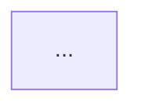

# AGENTS.md

This repository is `berryjune07/berryjune07.github.io`, the source for **Jiho's Blog**. Treat it as a long-term academic notebook, not as a generic Jekyll demo site. The visible site identity is scholarly and personal: mathematics, physics, computer science, and classical music notes written in a compact, textbook-like style.

These instructions apply to the entire repository unless a more specific `AGENTS.md` is added in a subdirectory.

## Core principle

When editing this repository, preserve the author's existing note-taking voice:

- concise academic English;
- direct mathematical exposition;
- many definitions, formulas, derivations, proofs, examples, and complexity analyses;
- minimal motivational filler;
- no generic "AI blog" prose;
- no unnecessary rewriting of old posts merely to make them more polished.

Before editing or adding a post, inspect at least 3 nearby posts in the same `_posts/<subject>/<topic>/` directory. Match that local series more strongly than this general guide.

## Repository shape

Important paths:

- `_config.yml`: global Jekyll/Hydejack configuration, site identity, fonts, comments, KaTeX/math-related behavior, Hydejack settings, plugin list, defaults.
- `_posts/`: dated blog posts. This is the main content area.
- `_posts/computer science/`: note that this folder name contains a space. Do not rename it to `computer-science`.
- `_posts/mathematics/number theory/`: note that this folder name also contains a space. Do not rename it to `number-theory`.
- `_featured_categories/`: category landing pages. Category slugs here are the canonical `categories:` values.
- `_featured_tags/`: tag landing pages. Tag slugs here are the canonical `tags:` values.
- `_data/`: data used by the theme, including KaTeX CDN data.
- `_includes/`, `_layouts/`, `_sass/`, `assets/`: Hydejack/theme customization, scripts, CSS/Sass, images, math rendering scripts.
- `assets/js/katex.js`: custom KaTeX macro definitions. Math posts depend on these macros.
- `_site/`: generated site output. This repository currently tracks `_site`.
- `.github/workflows/jekyll.yml`: deployment workflow. It uploads `./_site` directly to GitHub Pages.
- `Gemfile`: Ruby/Jekyll dependencies.
- `package.json`: minimal npm dependency list. Do not assume a large frontend build system.

## Build and deploy reality

Use Ruby/Jekyll commands for verification:

```bash
bundle install
bundle exec jekyll serve
bundle exec jekyll build
```

Important deployment caveat: the current GitHub Pages workflow uploads the existing `./_site` directory directly. It does **not** run `bundle exec jekyll build` inside the workflow before upload. Therefore:

- For normal source/content edits, edit `_posts`, `_featured_*`, `_config.yml`, layouts, includes, Sass, or assets as appropriate.
- Do not hand-edit generated HTML under `_site` to "fix" content.
- If the user wants the deployed site to reflect source edits immediately under the current workflow, rebuild `_site` with Jekyll and commit the regenerated `_site` output.
- If the task is only to prepare source changes, leave `_site` untouched unless explicitly requested.
- Never patch `_site` in ways that diverge from the source Markdown.

## Post directory map

The existing `_posts` hierarchy is subject-first, then topic/series:

```text
_posts/
  classical-music/
    rachmaninoff/
    ravel/
  computer science/
    algorithm/
      includes/
    problem-solving/
  mathematics/
    calculus/
    differential-geometry/
    linear-algebra/
    number theory/
    statistics/
    topology/
  physics/
    classical-mechanics/
    elementary-physics/
    fluid-mechanics/
    quantum-mechanics/
```

Do not flatten this hierarchy. Do not "normalize" spaces in folder names. New posts should go in the matching topic folder. If a new topic is necessary, create it only when it matches the existing category/tag model.

## Canonical category and tag slugs

Use category slugs from `_featured_categories/`:

- `mathematics`
- `physics`
- `computer-science`
- `classical-music`
- `games` exists but is not part of the main academic-note post structure unless the user asks for game content.

Use existing tag slugs from `_featured_tags/` whenever possible:

- Mathematics: `calculus`, `linear-algebra`, `statistics`, `topology`, `differential-geometry`, `number-theory`
- Physics: `elementary-physics`, `quantum-mechanics`, `classical-mechanics`, `fluid-mechanics`, `classical-electromagnetism`
- Computer Science: `algorithms`, `problem-solving`, `artificial-intelligence`
- Classical Music: `ravel`, `rachmaninoff`
- Games: `factorio`

Do not invent new slugs unless the user explicitly asks for a new category/tag and the matching `_featured_tags/<slug>.md` or `_featured_categories/<slug>.md` page is also needed.

## Post filenames

Use Jekyll post filenames:

```text
YYYY-MM-DD-kebab-case-title.md
```

For new files, prefer lowercase kebab-case after the date.

Existing exceptions must be preserved:

- `_posts/computer science/...` folder has a space.
- `_posts/mathematics/number theory/...` folder has a space.
- Some old filenames contain spaces, e.g. `2025-09-15-bernoullis equation.md`.
- Some old posts are intentionally very short or incomplete.

Do not rename existing posts casually. Renaming changes URLs and may break internal links.

## General post front matter

Every post starts with YAML front matter. Match nearby posts exactly.

### Academic math/physics posts

Typical form:

```yaml
---
layout: post
title: "Bases and Dimension"
subtitle: "la1.4"
classification: "Linear Algebra 1.4"
categories: mathematics
tags: linear-algebra
---
```

The `subtitle` is usually a compact series code:

- `calc1.1`, `calc...` for Calculus
- `stat1.2`, `stat...` for Statistics
- `la1.4`, `la2.1`, etc. for Linear Algebra
- `dg1.2` for Differential Geometry
- `nt1.3` for Number Theory
- `qm1.1` for Quantum Mechanics
- `fl2.1` for Fluid Mechanics
- `cm1.3` for Classical Mechanics
- `eph3` for Elementary Physics

The `classification` field expands the compact subtitle into a readable series label. Use it for textbook/lecture-note series posts. If nearby posts omit `classification`, do not add it unnecessarily.

Some older posts include:

```yaml
image:
    path: /assets/img/...
```

When such an image is used, there is often a source line immediately after the front matter, e.g.

```markdown
from **「Modern Quantum Mechanics」**: _Sakurai, J. J._
{:.figcaption}
```

Keep this pattern if adding source-book cover images.

### Algorithm posts

Typical form:

```yaml
---
layout: post
title: "Segment Tree"
subtitle: "segment-tree"
categories: computer-science
tags: algorithms
---
```

Algorithm posts usually omit `classification`. `subtitle` is usually the slug.

### Problem-solving posts

Typical form:

```yaml
---
layout: post
title: "[BOJ 1792] 공약수"
subtitle: "boj1792"
categories: computer-science
tags: problem-solving
---
```

Immediately after the front matter, include the problem link if the post is about an external judge:

```markdown
[https://www.acmicpc.net/problem/1792](https://www.acmicpc.net/problem/1792)
```

Use the problem ID in the subtitle. Korean problem names in titles are acceptable and existing style.

### Classical music posts

Typical form:

```yaml
---
layout: post
title: "Rachmaninoff, 9 Etudes-Tableaux, Op. 39"
subtitle: "rach-op39"
categories: classical-music
tags: rachmaninoff
---
```

Existing music posts are mostly embedded-score/performance posts, not prose-heavy essays. They use:

- a PDF `<object>` embed from IMSLP;
- a YouTube `<iframe>` inside `<div class="iframe-container">`.

Preserve this minimal media-centered format unless the user asks for analysis/review prose.

## Standard post opening

Most posts begin with the excerpt separator and TOC seed:

```markdown
<!--more-->
* this unordered seed list will be replaced by the toc
{:toc}
```

Use this exact pattern for substantial new posts. Place it after any initial source caption, blockquote teaser, or problem link, matching nearby posts.

Do not remove `<!--more-->`; `_config.yml` uses it as `excerpt_separator`.

Some posts have a small trailing-space variation in the TOC line. Do not rewrite old posts just to normalize whitespace.

## Headings and structure

Use Markdown headings, usually starting at `##`.

Common math/physics structures:

```markdown
## Introduction  // sometimes omitted in favor of a direct start
## <Main Concept>
### <Subconcept>
_Proof._
...
---
```

Common theorem/proof style:

- State the result directly, often without a formal theorem environment.
- Use `_Proof._` on its own line for ordinary visible proofs.
- Use `<details markdown="1"> <summary> Proof </summary>` for collapsible proofs.
- Use `---` horizontal rules to separate proof/result/comment blocks.

Algorithm structures always should exactly be:

```markdown
## Introduction
## Explanation
## Proof of Correctness
## Complexity
## Code
## Applications
```

Sometimes, if proof or correctness and complexity are so trivial that they do not need their own sections, they can be merged into the explanation or omitted.

Problem-solving structures often use:

```markdown
## Task
## Solution
## Optimization
## Code
```

Do not force all posts into the same outline. Match the neighboring series.

## Voice and prose style

The author's style is compact and lecture-note-like.

Preferred tone:

- "Let $V$ be..."
- "Then we naturally have..."
- "We can show..."
- "Let's think of..."
- "Suppose that..."
- "Thus..."
- "Therefore..."
- "We omit the proofs here."
- "We leave the verification of this as an exercise to the reader."

Avoid:

- long motivational introductions;
- generic blog-post fluff;
- over-explaining obvious algebra in prose;
- replacing formulas with verbose explanations;
- apologetic or conversational AI phrasing;
- headings like "Key Takeaways" unless the nearby series already uses them.

For old 2023 posts, the style is sometimes shorter and more intuitive. For newer 2025–2026 posts, the style is more rigorous and textbook-like. Do not rewrite old posts into the newer style unless explicitly asked.

## Math rendering and LaTeX style

The site uses KaTeX auto-render through `assets/js/katex.js`.

Use inline math:

```markdown
$f(x)=y$
```

Use display math with the existing KaTeX delimiters used in posts:

```markdown
\\[
...
\\]
```

Do not use raw HTML for math.

### Custom KaTeX macros

`assets/js/katex.js` defines many macros. Use them when they match nearby posts.

Important formatting macros:

```latex
\nl          % newline inside display math
\nt          % larger display-math line break
\dps         % \displaystyle
\b{v}        % bold vector, expands to \bold{v}
\bs{\theta}  % boldsymbol for Greek/symbolic vectors
```

Common mathematical macros:

```latex
\tr
\d
\dd{x}
\abs{x}
\norm{x}
\card{A}
\span
\supp
\sech
\csch
```

Derivative macros:

```latex
\odv{y}{x}
\odvi{y}{x}
\odvn{2}{y}{x}
\pdv{f}{x}
\pdvn{2}{f}{x}
\pdvs{f}{x}{y}
\mdv{\b{v}}
\fdv{F}{u}
\eval{...}
```

Vector calculus macros:

```latex
\grad
\curl
\div
\laplacian
```

Physics and quantum macros:

```latex
\hamd
\lagd
\brkt{a}{b}
\Brkt{a}{b}
\brktop{a}{A}{b}
\expct{A}
\comm{A}{B}
\acomm{A}{B}
\vpmt
\RydE
\eV
```

### Existing math idioms to preserve

Posts also contain recurring idioms such as:

```latex
\Set{ ... \| ... }
\set{ ... }
\sub
\R
\coloneqq
```

These are not all explicitly defined in `assets/js/katex.js`, but they appear in existing posts. Do not globally replace them or "fix" them without checking rendered output. When adding new math, prefer the locally dominant notation in nearby posts.

### Vector notation

There are two vector styles in the repository:

- Many physics and older linear-algebra posts use `\b{v}`, `\b{r}`, `\bs{\theta}`.
- Some newer linear-algebra posts use `\mathbf{v}`.

Match nearby posts in the same series. Do not normalize one style across the repository.

### Line breaks in display math

The author's display equations often use `\nl` and `\nt` instead of raw `\\`:

```latex
\\[
\begin{align\*}
A &= B \nl
  &= C
\end{align\*}
\\]
```

Use this style when writing long aligned derivations, especially in physics and advanced math posts.

### Brackets and set notation

The repository uses a mixture of:

```latex
[1:N]
[l:r]
\Set{ x \mid P(x) }
\set{A_i}_{i \in I}
```

Do not over-standardize. Preserve local notation.

## Figures, captions, and images

Common image pattern:

```markdown

{:.centered}

Caption text
{:.figcaption}
```

Sometimes width is specified inline:

```markdown
{: width="50%"}
{:.centered}
Cartesian coordinates
{:.figcaption}
```

Use this pattern for academic diagrams.

When adding external images, prefer stable sources and include a concise caption. Avoid decorative images that do not support the mathematical/physical content.

## Tables

Tables are used when they clarify conceptual comparisons, especially in introductory physics or quantum mechanics. Keep tables compact and readable.

Do not create large tables when a formula or bullet list would match the existing style better.

## Collapsible proof blocks

For longer proofs, use:

```markdown
<details markdown="1"> <summary> Proof </summary>
...
</details>
```

Keep a space between `<details markdown="1">` and `<summary>` if matching existing posts.

## Mermaid diagrams

Algorithm posts may use Mermaid diagrams:



`_config.yml` has `mermaid: true`. Use Mermaid for tree/graph/data-structure visualization when it materially improves the post. Do not add Mermaid merely for decoration.

## Algorithm posts

Algorithm posts are not just coding tutorials. They often blend:

- a concise conceptual introduction;
- mathematical definition of the abstraction, e.g. monoids for segment trees;
- correctness or complexity proof;
- diagrams when useful;
- concise C++ snippets.

When writing algorithm posts:

- State the data structure or algorithm formally.
- Include invariants when relevant.
- Include a `## Complexity` section for nontrivial algorithms.
- Include C++ only when it helps; do not dump unrelated full templates.
- Use small generic code with placeholders such as `Node`, `data`, `merge`, `identity` when the post is conceptual.
- If using local visualization HTML, place it under `_posts/computer science/algorithm/includes/` and include it with:

```liquid
include_relative includes/name.html
```

Do not move these include files to global `_includes` unless redesigning the site.

## Problem-solving posts

Problem-solving posts should not copy full problem statements. They should summarize the task mathematically.

Pattern:

1. front matter;
2. online judge link;
3. `<!--more-->` and TOC;
4. `## Task`;
5. `## Solution`;
6. optional `## Optimization`;
7. optional `## Code`.

For BOJ posts:

- title format: `"[BOJ <id>] <Korean problem title>"`
- subtitle format: `"boj<id>"`
- tag: `problem-solving`
- category: `computer-science`
- first body line: Markdown link to the BOJ problem.

Mathematical transformations are preferred over long narrative. For number-theoretic problems, use sums, Möbius functions, floors, grouping arguments, and complexity estimates as in existing posts.

## Mathematics post style by topic

### Calculus

Calculus posts are introductory but formal. They use definitions, simple diagrams, and concise examples. They often introduce familiar objects in set/function notation.

Use:

- definitions first;
- geometric or visual interpretation when helpful;
- simple theorem statements;
- equations in display math;
- images with centered captions.

### Statistics

Statistics posts are more axiomatic and theorem-oriented. They use sigma-algebras, probability functions, random variables, distribution functions, expectations, moment-generating functions, inequalities, order statistics, and convergence concepts.

Use:

- formal definitions;
- enumerated theorem properties;
- displayed derivations;
- collapsible proof blocks for longer proofs;
- concise but rigorous probability notation.

### Linear Algebra

Newer linear-algebra posts are among the most polished and rigorous. They use:

- equivalent conditions;
- basis/dimension arguments;
- Zorn's lemma where appropriate;
- direct sums;
- finite and infinite-dimensional cases;
- linear transformations, kernels, images, and coordinate matrices.

Use a textbook style with precise hypotheses. Do not add casual analogies unless a nearby post does.

### Differential Geometry and Topology

Older differential-geometry/topology posts are shorter and more intuitive. They often cite a source book/image and explain concepts like charts, parametrizations, atlases, manifolds, and transition maps.

Use concise explanations and diagrams. Do not over-expand these into modern textbook chapters unless asked.

### Number Theory

The number theory folder currently includes foundational/axiomatic material. It may be incomplete. Preserve the concise foundational style and series metadata.

## Physics post style by topic

### Elementary Physics

Elementary physics posts define physical quantities and derive standard formulas. They include coordinate-system diagrams and unit/interpretation comments.

Use:

- definitions;
- SI units when relevant;
- vector notation;
- standard derivations;
- diagrams with captions.

### Quantum Mechanics

Quantum mechanics posts are based on textbook-style notes and often reference source books. They use bra-ket notation, operators, commutators, expectation values, Schrödinger equation, wavefunctions, perturbative ideas, and atomic examples.

Use the quantum KaTeX macros in `assets/js/katex.js` when appropriate:

```latex
\brkt{\phi}{\psi}
\expct{A}
\comm{A}{B}
```

Preserve the source-book caption style if present.

### Classical Mechanics

Classical mechanics posts are derivation-heavy. They use generalized coordinates, virtual work, Lagrangians, Hamilton's principle, conservation laws, central-force problems, and energy functions.

Use long aligned derivations when needed. Keep the physical interpretation short and placed after the mathematical result.

### Fluid Mechanics

Fluid mechanics posts are dense and tensor/vector-calculus heavy. They use continuum-mechanics notation, stress tensors, flux tensors, strain-rate tensors, Euler/Navier-Stokes equations, potential flow, waves, and coordinate-system expressions.

Use:

```latex
\pdv{...}{...}
\mdv{...}
\grad
\div
\curl
\laplacian
\b{v}
\bs{\sigma}
```

Be careful with notation consistency. Do not simplify derivations by removing tensor expressions.

## Classical music post style

Current classical music posts are media-reference pages:

- front matter;
- TOC seed;
- embedded IMSLP PDF;
- embedded YouTube performance.

Do not convert them into long essays unless the user explicitly asks. If adding a new piece, match the same `<object>` and `<iframe>` pattern.

## Placeholder and incomplete posts

Several posts are intentionally incomplete or skeletal. Examples include algorithm posts with only front matter, `<!--more-->`, and TOC, and sometimes an empty `##` heading.

Rules:

- Do not delete them.
- Do not mark them as errors.
- Do not remove them from the site unless the user asks.
- If asked to complete one, preserve its filename, front matter, subtitle, category, tag, and TOC seed.
- Add content after the existing TOC seed.
- If an empty heading exists, either complete it naturally or remove it only as part of completing that post.

## Internal links and permalinks

`_config.yml` sets `permalink: none`, so generated URLs are category-based and slug-like, e.g.:

```text
/mathematics/bases-and-dimension.html
/physics/viscous-fluids-and-the-navier-stokes-equation.html
/computer-science/segment-tree.html
```

When linking internally, use existing generated paths and anchors. Do not assume date-based URLs.

Examples:

```markdown
[here](/mathematics/subspace-and-span.html#complementary-subspace)
```

If renaming a post is unavoidable, update internal links and regenerated `_site`.

## Assets and theme safety

Do not edit theme/layout files unless the task explicitly concerns the site design, navigation, comments, KaTeX rendering, CSS, JavaScript, or Hydejack behavior.

Before changing:

- `_includes/`
- `_layouts/`
- `_sass/`
- `assets/js/`
- `assets/css/`
- `_config.yml`

inspect where the component is used and keep changes minimal.

Do not change these without explicit user instruction:

- site title/tagline;
- author metadata;
- giscus settings;
- Google Analytics ID;
- Hydejack navigation behavior;
- KaTeX CDN settings;
- custom KaTeX macros.

## Generated output policy

`_site/` is generated output, but the repository's deployment workflow currently depends on it.

Therefore:

- Never edit `_site` by hand as the primary fix.
- For content changes, edit source Markdown first.
- If deployment-ready output is requested, run `bundle exec jekyll build` and commit the generated `_site` changes.
- If only drafting or source-only editing is requested, do not touch `_site`.
- If `_site` and source disagree, source files are the truth.

## Formatting rules

- Use UTF-8.
- Keep Markdown readable.
- Use fenced code blocks with language labels such as `cpp`, `mermaid`, `bash`, or `liquid`.
- Keep YAML front matter compact.
- Quote titles in YAML.
- Use scalar category/tag values when existing posts do, e.g. `categories: mathematics`, not YAML arrays.
- Preserve existing indentation style in front matter, especially for nested `image.path`.
- Do not introduce Prettier/formatter changes over large files.
- Do not mass-normalize whitespace across posts.

## Editing checklist

Before committing changes, verify:

- Did I inspect nearby posts in the same topic folder?
- Did I preserve the correct folder name, including spaces where present?
- Did I use the existing front matter pattern?
- Did I use an existing category slug?
- Did I use an existing tag slug?
- Did I keep `<!--more-->` and the TOC seed?
- Did I match the local math macro/vector notation style?
- Did I avoid deleting placeholder posts?
- Did I avoid hand-editing `_site`?
- If deployment-ready output is needed, did I rebuild with `bundle exec jekyll build`?
- Did I keep the prose compact, academic, and non-generic?
- Did I avoid unrelated theme/config/social/comment changes?

## When uncertain

If a requested change could affect URLs, categories, tags, deployment, math rendering, or theme behavior, do the smallest safe source change and explain the uncertainty. Do not make broad cleanup commits.
