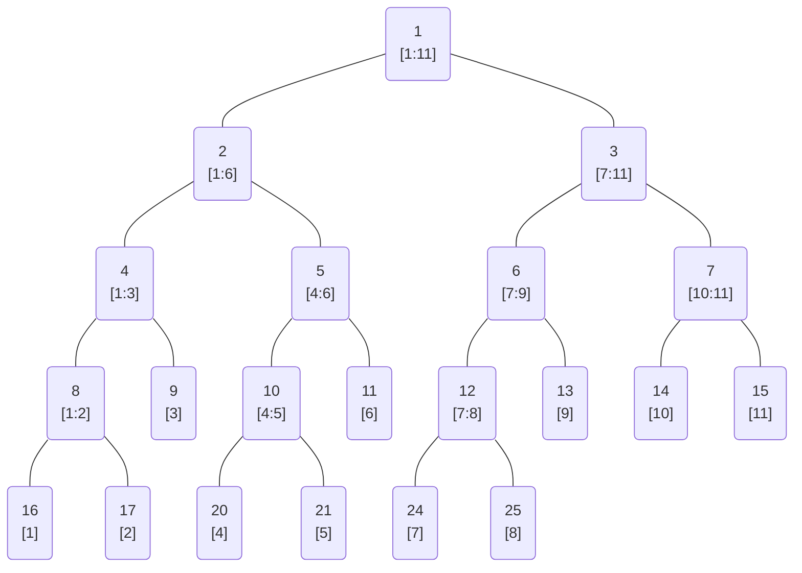
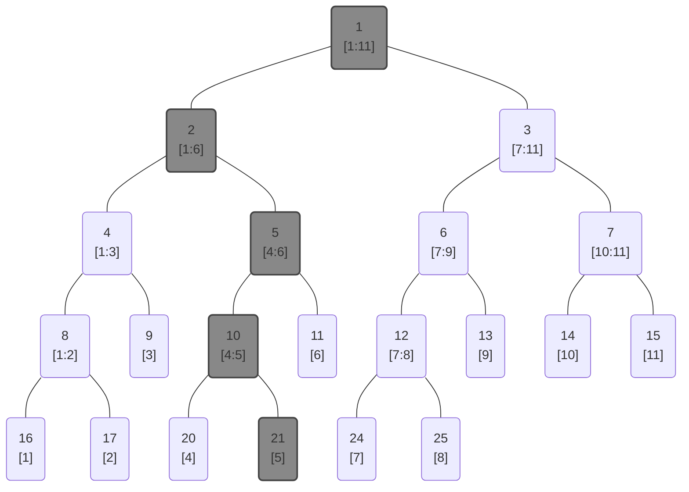
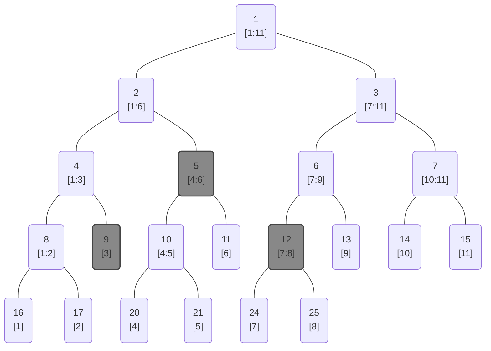

<!--more-->
* this unordered seed list will be replaced by the toc
{:toc}

## Introduction
A **segment tree** is a tree data structure for storing intervals, or segments. It allows to perform queries and updates on the intervals in very efficient manner.
There are many applications of segment trees: calculating the sum of all elements in a range, finding the minimum or maximum element in a range, etc.

## Segment Tree

### Explanation
Segment tree is a data structure for monoids $(M, \ast)$, where $M$ is a set with an identity element $e$ and an associative binary operation $\ast$.

Given an array $A = \[a_1,\cdots,a_N\]$ of size $N$, a segment tree is a binary tree where each node represents an interval $[l:r]$ of the array.
Each node stores the result of applying the operation $\ast$ to all elements in the interval it represents, i.e. $a_l \ast \cdots \ast a_r$.
The root node represents the entire array $[1:N]$, and each leaf node represents a single element of the array.
Every parent node has left and right children, which represent the left and right halves of the parent's interval.
You can see that the segment tree is a _full_ and _complete binary tree_.

Segment tree can carry out two types of queries in $O(\log N)$ time complexity:
1. **Range query**: Given a range $[l:r]$, find the result of applying the operation $\ast$ to all elements in the range. In other words, calculate $a_l \ast a_{l+1} \ast \cdots \ast a_r$.
2. **Point update**: Given an index $i$ and a new value $v$, update the element $a_i$ to $v$.

The tree can be technically implemented as an array,
where the node with binary number index $\overline{i}_2$ has two child nodes with index
$\overline{i0}_2$ (left child) and $\overline{i1}_2$ (right child). The root node has index $1$.
If a node represents an interval $[l,r]$, then by defining $m=\left\lfloor\frac{l+r}{2}\right\rfloor$,
the left child node represents the interval $[l,m]$ and the right child node represents the interval $[m+1,r]$.
The leaf nodes represent individual array elements.

There are two main ways to implement the tree.
The first one is to construct only $N$ leaf nodes, for which we usually use recursive methods.
The second one is to construct a complete binary tree, thinking of the array as being padded with identity elements up to the next power of two.
We can use simple iterative methods for the second one. Let's see the example for the first approach.



The binary tree above is an example of a segment tree for the array with 11 elements.
Each node is written in the form of node index and the interval it represents.
When we update the 5th element of the array, the segment tree will be updated as follows.



When we query the sum of the elements in the range $[3,8]$, following nodes will be visited.



### Complexity

Let's assume that merging two nodes takes $O(T)$ time.
In general, it takes constant time $O(1)$, but in specific cases $T$ can be a function of the array size $N$.
Also, let's assume that the tree is a complete binary tree, i.e., we're taking the second approach which we discussed earlier.

\1. **Build**: $O(TN)$

Since the tree is a full and complete binary tree, its height is:

\\[
H = \lceil \log_2 N \rceil
\\]

Building the tree requires visiting every node and merging them.
There are $2^{H+1}-1$ nodes in the tree (perfect binary tree).

\\[
2^{H+1}-1 \le 2^{\log_2 N + 2} -1 = 4N-1
\\]

Therefore, the build time is $O(TN)$.

\2. **Range query**: $O(T\log N)$

First, we should prove that at each height level of the tree, an arbitrary range query visits at most two nodes.
At level $l$, the tree has $2^l$ nodes, which are equipartitioned intervals of the array.

\\[
I_{t,k} = \left\[ (k-1) \cdot 2^t + 1, k \cdot 2^t \right\] \quad (1 \le k \le 2^h, 0 \le t \le H)
\\]

Leaves correspond to $t=0$, length $1$. The root corresponds to $t=H$, length $m=2^H$.
What we should do is to get the upper bound of the number of intervals to cover an arbitrary range query $[l,r] \subseteq [1,m]$.

\\[
\[l,r\] = \bigsqcup_{j=1}^q I_{t_j,k_j}
\\]

Let $\mathcal{D} = \Set{I_{t_j,k_j} | j \in \mathcal{J} }$ be the canonical dyadic decomposition of the range $[l,r]$.
For fixed $t$, define $\mathcal{D}\_t = \Set{I\_{t,k} \in \mathcal{D}}$.
Let's think from the bottom. Introduce the following notations for an arbitrary range $I$,

\\[
f(I,t) = \Set{ I_{t,k} \subseteq I } , \quad
g(I,t) = \Set{ I_{t,k} \in f(I,t) | \left( \min I \in I_{t,k} \land 2\mid k \right) \lor \left( \max I \in I_{t,k} \land 2\nmid k \right) } \nt
U(S) = \bigsqcup_{p \in S} p , \quad
I_0 = \[l_0,r_0\], \quad I_{i+1} = I_i \setminus U(g(I_i,i))
\\]

This means that, we remove the leftmost and rightmost intervals at each height if
they cannot be merged to form a larger interval. Let's prove the following lemma inductively.

\\[
\min I_t \equiv 1, \; \max I_t \equiv 0 \pmod{2^t}
\\]

if $I_t \neq \emptyset$.

<details markdown="1"> <summary> Proof </summary>

The statement is obviously true for $t=0$. Assume that it's true for some fixed $t$.
Then we can simply know that $I_t$ can be equipartitioned into intervals of length $2^t$ which are dyadic intervals.

\\[
I_t = U(f(I_t,t))
\\]

Let's sort $f(I_t,t)$ in ascending order of $k$ as follows.

\\[
f(I_t,t) = \Set{ I_{t,k} | l_t \le k \le r_t }
\\]

Then we have:

\\[
\min I_t = (l_t-1) \cdot 2^t + 1, \; \max I_t = r_t \cdot 2^t
\\]

Assume that $I_{t+1} \neq \emptyset$. We should look for two cases for $\min I_t$.

- $\min I_t \equiv 1 \pmod{2^{t+1}} \Rightarrow 2 \nmid l_t \Rightarrow I_{t,l_t} \nsubseteq g(I_t,t)
\Rightarrow \min I_{t+1} = \min I_t \equiv 1 \pmod{2^{t+1}}$
- $\min I_t \equiv 2^t + 1 \pmod{2^{t+1}} \Rightarrow 2 \mid l_t \Rightarrow I_{t,l_t} \subseteq g(I_t,t)
\Rightarrow \min I_{t+1} = \min I_t + 2^t \equiv 1 \pmod{2^{t+1}}$

We should also look for two cases for $\max I_t$.

- $\max I_t \equiv 0 \pmod{2^{t+1}} \Rightarrow 2 \mid r_t \Rightarrow I_{t,r_t} \nsubseteq g(I_t,t)
\Rightarrow \max I_{t+1} = \max I_t \equiv 0 \pmod{2^{t+1}}$
- $\max I_t \equiv 2^t \pmod{2^{t+1}} \Rightarrow 2 \nmid r_t \Rightarrow I_{t,r_t} \subseteq g(I_t,t)
\Rightarrow \max I_{t+1} = \max I_t + 2^t \equiv 0 \pmod{2^{t+1}}$

Thus, the statement also holds for $t+1$ for both cases.
</details>

By the lemma, we have

\\[
I_t = U(f(I_t,t)) \quad \Rightarrow \quad 2^t \mid \abs{I_t}
\\]

for all $t$. Also, it is trivial by definition that $U(g(I_t,t)) \subseteq I_t$, it implies that

\\[
I_{t+1} \sqcup U(g(I_t,t)) = I_t
\\]

Since the size of $I_t$ is finite and also decreases with $t$,
there always exists a constant $q$ such that $\abs{I_q} < 2^q$.
We got that $2^q \mid \abs{I_q}$, so $\abs{I_q} = 0$ and $I_q = \emptyset$,
which implies that we could always fully cover the given range by this method.
Therefore, by the expression above, we have:

\\[
I_0 = \bigsqcup_{t=0}^{q-1} U(g(I_t,t)) = U\left( \bigsqcup_{t=0}^{q-1} g(I_t,t) \right)
\\]

We finally got the expression for the canonical dyadic decomposition $\mathcal{D}$.

\\[
\mathcal{D}\_t = g(I_t,t), \quad \mathcal{D} = \bigsqcup_{t=0}^{q-1} \mathcal{D}_t
\\]

Now the problem reduces to finding the nodes of $\mathcal{D}$.
By definition, we easily have:

\\[
\abs{\mathcal{D}_t} \le 2
\\]

The upper bound of $q$ is the height of the tree $H$, $q \le H$.

\\[
\abs{\mathcal{D}} = \sum_{t=0}^{q-1} \abs{\mathcal{D}_t} \le 2q \le 2 \lceil \log_2 N \rceil
\\]

In conclusion, the update query visits at most $O(\log N)$ nodes,
so the time complexity is $O(T\log N)$.

\3. **Point update**: $O(T\log N)$

When we update a single element, we need to update all nodes containing the element.
There is always one node containing the element for each level of the tree.
Therefore, we just need to visit all nodes on the path from the leaf to the root.
The time complexity is $O(TH) = O(T\log N)$.

## Code
Let's see the sample code implemented with a recursive approach first.
```cpp
const int N;
const int TREE_SIZE = 1 << ((int)ceil(log2(N)) + 1);

data A[N];
Node tree[TREE_SIZE];

Node merge(Node a,Node b); // merge two nodes
Node conv(data a); // convert data to node
Node identity(); // return identity node

Node init(int nd,int l,int r){
    if(l==r) return tree[nd] = conv(A[l]);
    int m = (l+r)/2;
    return tree[nd] = merge(init(nd*2,l,m),init(nd*2+1,m+1,r));
}

Node update(int nd,int l,int r,int idx,data val){
    if(idx<l or r<idx) return tree[nd];
    if(l==r) return tree[nd] = conv(val);
    int m = (l+r)/2;
    return tree[nd] = merge(update(nd*2,l,m,idx,val),update(nd*2+1,m+1,r,idx,val));
}

Node Query(int nd,int l,int r,int s,int e){
    if(e<l or r<s) return identity();
    if(s<=l and r<=e) return tree[nd];
    int m = (l+r)/2;
    return merge(Query(nd*2,l,m,s,e),Query(nd*2+1,m+1,r,s,e));
}
```

So here, the data type **Node** should be the monoid structure $(M, \ast)$.
Commonly, we store data in the array $A$ in another data type(**data**, such as integer etc.), because it's easy and intuitive.
If such the data type is different with the node, you should convert the data to the node structure in the function **conv**.

Now let's see the sample code implemented with an iterative approach.
```cpp
void init(){
    for(int i=0; i<N; i++) tree[i+TREE_SIZE/2] = conv(A[i]);
    for(int i=TREE_SIZE/2-1; i>0; i--) tree[i] = merge(tree[i<<1],tree[i<<1|1]);
}

void update(int idx,data val){
    idx += TREE_SIZE/2;
    tree[idx] = conv(val);
    while(idx>1){
        idx >>= 1;
        tree[idx] = merge(tree[idx<<1],tree[idx<<1|1]);
    }
}

Node Query(int s,int e){
    s += TREE_SIZE/2; e += TREE_SIZE/2;
    Node res = identity();
    while(s<=e){
        if(s&1) res = merge(res,tree[s++]);
        if(!(e&1)) res = merge(res,tree[e--]);
        s >>= 1; e >>= 1;
    }
    return res;
}
```

It is faster to use bitwise operations to access the nodes.

## Applications

* Range sum query
* Range minimum/maximum query
* Range gcd/lcm query