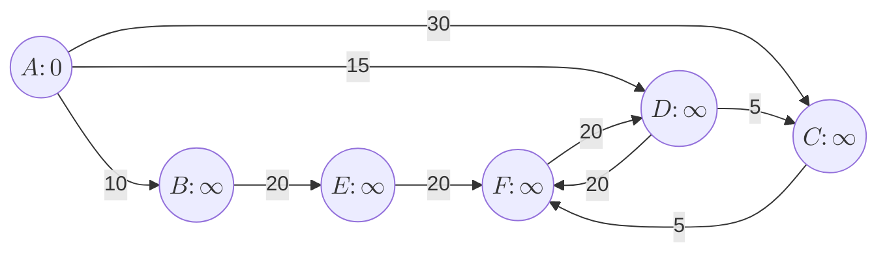
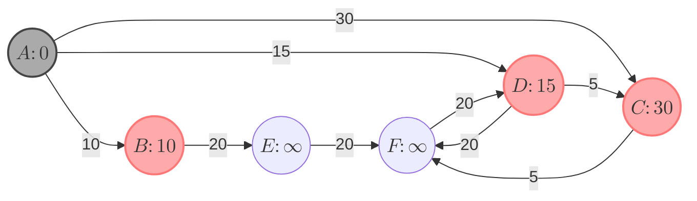
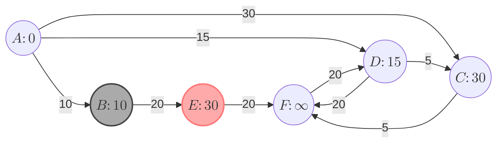
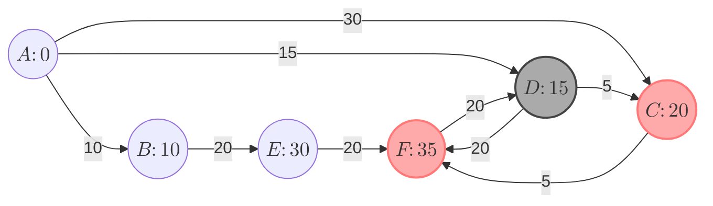
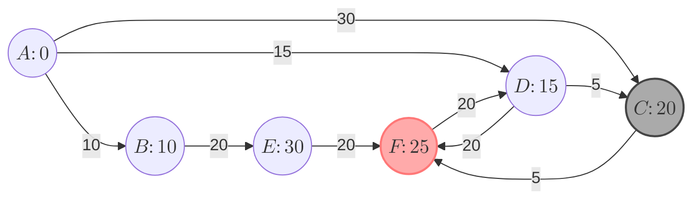
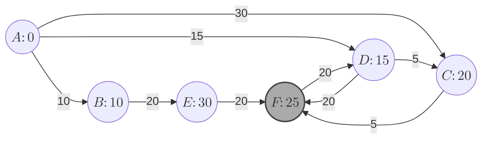
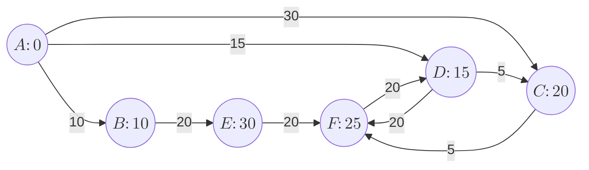

<!--more-->
* this unordered seed list will be replaced by the toc
{:toc}

## Introduction

**Dijkstra's algorithm** is a classic algorithm for finding the shortest paths between nodes in a graph,
which may represent, for example, road networks. It is a greedy algorithm that builds the shortest path tree from the source node to all other nodes in the graph.
The algorithm maintains a _priority queue_ of nodes to explore, always expanding the node with the smallest known distance from the source.
Commonly used in routing and navigation systems, Dijkstra's algorithm is efficient for graphs with non-negative edge weights.

## Explanation

\1. Initialize the distance to the source node to 0 and all other nodes to infinity. Add the source node to the priority queue.

<center>
$\mathrm{pq} = \Set{(A,0)}$
</center>
<br>

\2. While the priority queue is not empty, do the following:
   - Extract the node with the smallest distance from the priority queue.
   - For each neighbor of this node, calculate the distance through this node.
   - If this distance is smaller than the known distance to the neighbor, update the neighbor's distance and add it to the priority queue.


<center>
$\mathrm{pq} = \Set{(B,10), (D,15), (C,30)}$
</center>
<br>


<center>
$\mathrm{pq} = \Set{(D,15), (C,30), (E,30)}$
</center>
<br>


<center>
$\mathrm{pq} = \Set{(C,20), (C,30), (E,30), (F,35)}$
</center>
<br>


<center>
$\mathrm{pq} = \Set{(F,25), (C,30), (E,30), (F,35)}$
</center>
<br>


<center>
$\mathrm{pq} = \Set{(C,30), (E,30), (F,35)}$
</center>
<br>

It remains the same until the priority queue is empty.

\3. The algorithm terminates when all nodes have been processed, and the shortest path from the source to each node is known.


## Complexity

The time complexity of Dijkstra's algorithm depends on the data structure used for the priority queue.
Using a binary heap, the time complexity is $O((V + E) \log V)$, where $V$ is the number of vertices and $E$ is the number of edges in the graph.
Since $E$ can be at most $V(V-1)$ in a dense graph, we can also express the time complexity as $O(E \log V)$.
If an adjacency list is used, the space complexity is $O(V + E)$ for storing the graph and $O(V)$ for the distance array.
 - **Time Complexity**: $O(E \log V)$
 - **Space Complexity**: $O(V + E)$

## Code

Let's see the sample code.
```cpp
struct edge{
    int to,cost;
    bool operator<(const edge &e) const { return cost>e.cost; }
};
const int MAX, INF;
vector<edge> G[MAX];
int D[MAX]; // D[i] is the shortest distance from the source to node i

void dijkstra(int K){ // K is the source node
    fill(D,D+MAX,INF);
    priority_queue<edge,vector<edge>> pq;
    pq.push({K,0});
    D[K]=0;
    while(pq.size()){
        auto [now,dist] = pq.top();
        pq.pop();
        if(dist>D[now]) continue;
        for(auto [nxt,ndist]:G[now]) if(D[nxt]>dist+ndist){
            D[nxt] = dist+ndist;
            pq.push({nxt,D[nxt]});
        }
    }
}
```

## Applications

- **Routing and Navigation**: Used in GPS systems to find the shortest path between locations.
- **Network Routing Protocols**: Employed in protocols like OSPF (Open Shortest Path First) to determine the best path for data packets.
- **Pathfinding in Games**: Utilized in video games for AI navigation and pathfinding.