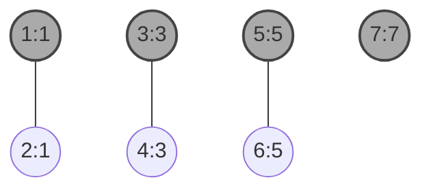
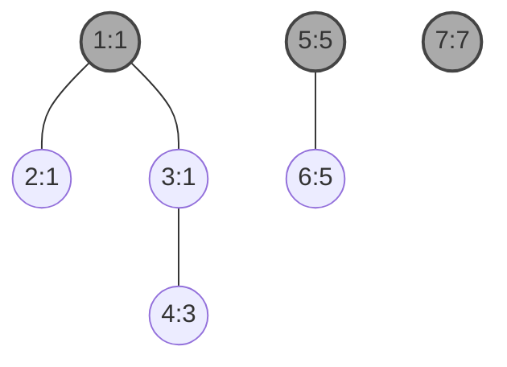
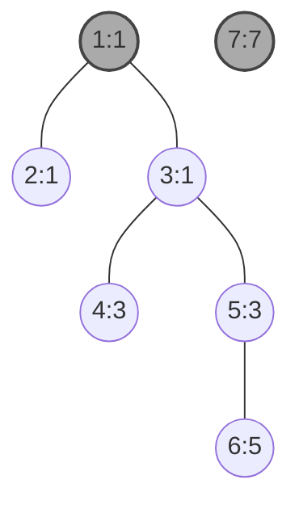
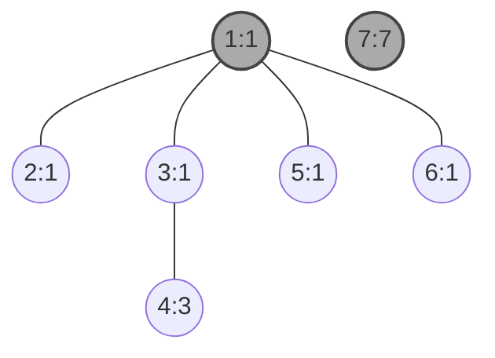

<!--more-->
* this unordered seed list will be replaced by the toc
{:toc}

## Introduction

A **Disjoint-Set Forest** (**Union-Find Forest**) is a data structure that keeps track of a partition of a set into disjoint subsets.
It supports three main operations:
1. **Add**: Add a new tree to the forest.
2. **Union**: Merge two trees into one.
3. **Find**: Determine which tree a particular element belongs to.

This data structure is particularly useful in applications such as network connectivity, clustering, and Kruskal's algorithm for finding the Minimum Spanning Tree (MST).

## Explanation

The Disjoint-Set Forest is implemented using a collection of trees, where each tree represents a disjoint set.
Let's denote the union operation as `union(x, y)` which merges the sets containing elements `x` and `y`,
and the find operation as `find(x)` which returns the representative (or root) of the set containing `x`.
And also let's denote the node as the form `value: parent`, where `value` is the element and `parent` is the parent node in the tree.
Now we will seek the most efficient way to implement these operations. Consider the forest below:

Root nodes of each tree are indicated with a darker color.
After performing `union(1, 2)`, `union(3, 4)` and `union(5, 6)`, the forest becomes:

After performing `union(1, 4)`, the forest becomes:

After performing `union(4, 5)`, the forest becomes:

After performing `find(6)`, we can see that `6` belongs to the tree with root `1`,
so we can update the parent of nodes on the path from `6` to `1` to point directly to `1`.

This process is known as **path compression** and helps to flatten the structure of the tree, making future `find` operations faster.

## Complexity

The time complexity of the `find` operation is nearly constant, specifically $O(α(n))$, where α is the inverse Ackermann function.
The `union` operation also has a time complexity of $O(α(n))$ when using path compression and union by size or rank,
since it involves two `find` operations followed by a constant-time merge.

## Code

Let's see the sample code.

```cpp
const int MAX;
int par[MAX];

void init(){
    for(int i=0; i<MAX; i++) par[i]=i;
}

int Find(int x){
    if(par[x]==x) return x;
    return par[x]=Find(par[x]);
}

void Union(int u,int v){
    u=Find(u), v=Find(v);
    par[v]=u;
}
```

We can optimize the `Union` operation further by using **union by size** or **union by rank**.
This means that when we merge two trees, we always attach the smaller tree under the root of the larger tree.

- Union by size

```cpp
int size[MAX];

void init(){
    for(int i=0; i<MAX; i++) par[i]=i, size[i]=1;
}

void Union(int u,int v){
    u=Find(u), v=Find(v);
    if(u==v) return;
    if(size[u]<size[v]) swap(u,v);
    par[v]=u;
    size[u]+=size[v];
}
```

- Union by rank

```cpp
int rank[MAX];

void init(){
    for(int i=0; i<MAX; i++) par[i]=i, rank[i]=0;
}

void Union(int u,int v){
    u=Find(u), v=Find(v);
    if(u==v) return;
    if(rank[u]<rank[v]) swap(u,v);
    par[v]=u;
    if(rank[u]==rank[v]) rank[u]++;
}
```

## Applications

Disjoint-Set Forests are widely used in various applications, including:
- **Network Connectivity**: To determine if two nodes are in the same connected component.
- **Kruskal's Algorithm**: To find the Minimum Spanning Tree of a graph.
- **Image Processing**: To segment images into connected components.