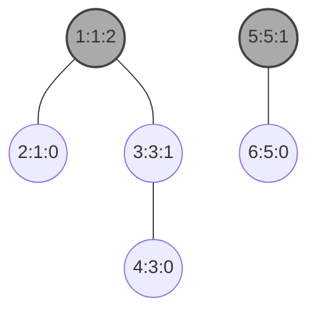
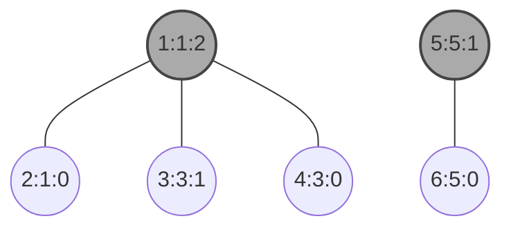
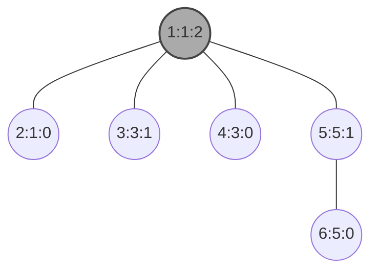

<!--more-->
* this unordered seed list will be replaced by the toc
{:toc}

## Introduction

A **Disjoint-Set Forest** (**Union-Find Forest**) is a data structure that keeps track of a partition of a set into disjoint subsets.
It supports three main operations:
1. **Add**: Add a new tree to the forest.
2. **Union**: Merge two trees into one.
3. **Find**: Determine which tree a particular element belongs to.

This data structure is particularly useful in applications such as network connectivity, clustering, and Kruskal's algorithm for finding the Minimum Spanning Tree (MST).

## Explanation

The Disjoint-Set Forest is implemented using a collection of trees, where each tree represents a disjoint set.
Let's denote the union operation as `union(x, y)` which merges the sets containing elements `x` and `y`,
and the find operation as `find(x)` which returns the representative (or root) of the set containing `x`.
And also let's denote the node as the form `value:parent:rank`, where `value` is the value of the node, `parent` is the value of its parent node, and `rank` is the rank of the node (used for union by rank).

The interactive demo below starts with nodes `1` through `6` and lets you apply **union by rank** and **path compression** yourself.
Start with six singleton sets and modify the forest directly.



Now we will seek what _path compression_ and _union by rank_ are, and how they help to optimize the `find` and `union` operations.
Path compression enables us to find the representative(or root) of a tree in nearly constant time by flattening the structure of the tree whenever we perform a `find` operation.
Union by rank helps to keep the tree flat by always attaching the smaller tree under the root of the larger tree during a `union` operation.

Consider the forest below:

```mermaid
graph TD
    A((1:1:2)):::root; B((2:1:0)); C((3:3:1));
    D((4:3:0)); E((5:5:1)):::root; F((6:5:0));
    A---B; C---D; E---F; A---C;
    classDef root fill:#aaa,stroke:#444,stroke-width:2px;
```
Root nodes of each tree are indicated with a darker color.
Let's perform `union(4,6)` on the forest above. First, we find the representatives of `4` and `6`
by `find(4)` and `find(6)`, which will return `1` and `5` respectively while also performing path compression on the way.


```mermaid
graph TD
    A((1:1:2)):::root; B((2:1:0)); C((3:3:1));
    D((4:3:0)); E((5:5:1)):::root; F((6:5:0));
    A---B & C & D; E---F;
    classDef root fill:#aaa,stroke:#444,stroke-width:2px;
```

Then we perform the `union` operation by attaching the tree with root `5` under the tree with root `1` since it has a higher rank.


```mermaid
graph TD
    A((1:1:2)):::root; B((2:1:0)); C((3:3:1));
    D((4:3:0)); E((5:5:1)); F((6:5:0));
    A---B & C & D & E; E---F;
    classDef root fill:#aaa,stroke:#444,stroke-width:2px;
```

When the rank of the roots which we are trying to union are the same, we can choose either one as the new root and increase its rank by 1.

## Complexity

Tarjan's classical analysis shows that the total time for $M$ operations (including $N$ `make-set` operations) is $O(M \alpha(M,N)+N)$,
where $N$ is the number of elements in the forest and $\alpha$ is the inverse Ackermann function, which grows very slowly and is practically constant for all reasonable values of $N$.
Here we will only prove that `find` and `union` operations can be performed in amortized $O(\alpha(N))$ time.
We will use the potential method to analyze the amortized time complexity of the operations.

We represent each set by a rooted tree. For every node $x$, let $p(x)$ be the parent of $x$ and $r(x)$ be the rank of $x$.
A node $x$ is a root if and only if $p(x)=x$.
The operations are defined as follows:

\\[
\mathtt{find}(x)=
\begin{cases}
x &; p(x)=x \nl
p(x) \gets \mathtt{find}(p(x)), \; p(x) &; p(x)\neq x
\end{cases}
\\]

\\[
\mathtt{link}(x,y) = \begin{cases}
\mathtt{false} &; x=y \nl
p(x) \gets y, \mathtt{true} &; r(x)<r(y) \nl
p(y) \gets x, \mathtt{true} &; r(x)>r(y) \nl
p(y) \gets x, r(x) \gets r(x)+1, \mathtt{true} &; r(x)=r(y)
\end{cases}
\\]

\\[
\mathtt{union}(x,y) = \mathtt{link}(\mathtt{find}(x), \mathtt{find}(y))
\\]

First of all, for every non-root node $x$, we have:

\\[
r(x) < r(p(x))
\\]

This can be proved inductively by checking every operation.
At the beginning, we have $r(x)=0$ for every node $x$, and there are only singleton trees, so the inequality holds.
- $\mathtt{link}$: if $r(x)<r(y)$, then we set $p(x) \gets y$ and $r(x)<r(p(x))=r(y)$ holds;
if $r(x)=r(y)$, then we set $p(y)\gets x, \; r(x)\gets r(x)+1$ and $r(y)<r(p(y))=r(x)$ holds.
- $\mathtt{find}$: if $p(x_1)\neq x_1$, we have a path $(x_1, \dots, x_k)$ where $x_k$ is the root and $p(x_i)=x_{i+1}$ for every $1\le i < k$.
Then we have $r(x_1)<\dots<r(x_k)$. After path compression, we set $p(x_i) \gets x_k$ for every $1\le i < k$, and $r(x_i)<r(p(x_i))=r(x_k)$ still holds.
Thus, the rank of a node is always less than the rank of its parent.

Also, for every node $x$, we have:

\\[
r(x) \le N-1
\\]

Every rank increase is caused by a `link` operation where the ranks of the two roots are the same.
Since each such event decreases the number of roots by one, there can be at most $N-1$ such events, and thus the rank of any node can never exceed $N-1$.
This is a weak upper bound, but it is sufficient for our analysis.

Now let's define a fast-growing hierarchy of functions $B_k: \mathbb{N} \to \mathbb{N}$ recursively as follows:

\\[
B_0(n) = n+1, \quad B_{k+1}(n) = B_k^{(n+1)}(n)
\\]

where $f^{(q)}$ denotes the $q$-fold composition of $f$ with itself.
Each $B_k$ is a rapidly strictly increasing function.
Now define

\\[
\beta(n) = \min \Set{ k\in \mathbb{N} \| B_k(1) \ge n }
\\]

The function $\beta$ grows extraordinarily slowly. In particular,

\\[
\beta(n) = O(\alpha(n))
\\]

where $\alpha$ is the inverse Ackermann function. We'll use this without proof.
Now let's quantify the size of the gap between $r(x)$ and $r(p(x))$ for a non-root node $x$ with positive rank.

The _level_ of a node $x$ is defined as:

\\[
\ell(x) \coloneqq \max \Set{ \ell \ge 0 \| B_\ell(r(x)) \le r(p(x)) }
\\]

The _degree_ of a node $x$ is:

\\[
d(x) \coloneqq \max \Set{ d \ge 1 \| B_{\ell(x)}^{(d)}(r(x)) \le r(p(x)) }
\\]

We will show that for every non-root node $x$ with positive rank, we have:

\\[
1 \le d(x) \le r(x)
\\]

$d(x) \ge 1$ is trivial by its definition. Now assume $d(x) \ge r(x)+1$. Then

\\[
B_{\ell(x)}^{(r(x)+1)}(r(x)) \le r(p(x))
\\]

By definition of $B_{\ell(x)+1}$, we have:

\\[
B_{\ell(x)+1}(r(x)) = B_{\ell(x)}^{(r(x)+1)}(r(x)) \le r(p(x))
\\]

This contradicts the maximality of $\ell(x)$, so we must have $d(x) \le r(x)$.
Also, we will show that for every non-root node $x$ with positive rank, we have:

\\[
\ell(x) < \beta(N)
\\]

First, we start from the following inequality:

\\[
B_{\beta(N)}(1) \ge N > r(p(x))
\\]

If $\ell(x) \ge \beta(N)$, then:

\\[
r(p(x)) \ge B_{\ell(x)}(r(x)) \ge B_{\beta(N)}(1) \ge N > r(p(x))
\\]

which is impossible. Thus, we must have $\ell(x) < \beta(N)$.
Now we define the potential of a node $x$ as:

\\[
\Phi(x) = \begin{cases}
\beta(N)r(x) &; p(x)=x \; \lor \; r(x)=0 \nl
\bigl(\beta(N)-\ell(x)\bigr)r(x)-d(x) &; \text{otherwise}
\end{cases}
\\]

Finally, define the potential of the forest $F$ as:

\\[
\Phi(F) = \sum_{x\in F} \Phi(x)
\\]

By the definition of $\Phi$, we have $\Phi(x) \ge 0$ for every node $x$, so $\Phi(F) \ge 0$ for every forest $F$.
Now we are ready to analyze the amortized time complexity of the `find` and `link` operations.

\1. $\mathtt{find}$: $O(\beta(N))$

Let the path from non-root node $x$ to the root be $(x_1, \dots, x_k)$ where $x_1=x$ and $x_k$ is the root.
Let's define:

\\[
P = \Set{ x_i \| 1 \le i < k }, \quad S_L = \Set{ v \in P \| \ell(v) = L, r(v) > 0 }
\\]

Let's also denote as:

\\[
r_i = r(x_i), \quad r_i^\prime = r(p(x_i)), \quad R = r(x_k)
\\]

Let's sort the nodes in $S_L$ in increasing order of their ranks.

\\[
S_L = \Set{ x_{i_1}, \dots, x_{i_m} } \quad (i_1 < \dots < i_m)
\\]

After path compression, we set $p(x_i) \gets x_k$ then $r_i^\prime \gets R$ for every $1 \le i < k$.
For $1 \le q \le m$, $r \bigl(p \bigl( x_{i_q} \bigr) \bigr)$ changes from $r_{i_q}^\prime$ to $R$ where $r_{i_q}^\prime \le R$,
so we have $\ell_{\text{new}}\bigl( x_{i_q} \bigr) \ge \ell_{\text{old}}\bigl( x_{i_q} \bigr) = L$.
Let's distinguish two cases:

- $\ell_{\text{new}}\bigl( x_{i_q} \bigr)\ge L+1$:

\\[
\Phi_{\text{new}}\bigl( x_{i_q} \bigr) \le \bigl(\beta(N)-(L+1)\bigr)r_{i_q}-1 \nl
\Phi_{\text{old}}\bigl( x_{i_q} \bigr)=\bigl(\beta(N)-L\bigr)r_{i_q}-d_{\mathrm{old}}\bigl( x_{i_q} \bigr) \nt
\Rightarrow \Phi_{\text{new}}\bigl( x_{i_q} \bigr) - \Phi_{\text{old}}\bigl( x_{i_q} \bigr) \le d_{\mathrm{old}}\bigl( x_{i_q} \bigr) - r_{i_q} - 1 \le -1
\\]

- $\ell_{\text{new}}\bigl( x_{i_q} \bigr) = L$:

If $q<m$,

\\[
r_{i_q}^\prime \le r_{i_{q+1}} \;\Rightarrow\; B_L \bigl( r_{i_q}^\prime \bigr) \le B_L \bigl( r_{i_{q+1}} \bigr) \le r_{i_{q+1}}^\prime \le R
\\]

By definition of $d_\text{old}\bigl( x_{i_q} \bigr)$, we have $B_L^{\left( d_\text{old}\left( x_{i_q} \right) \right)}\bigl( r_{i_q} \bigr) \le r_{i_q}^\prime$.
Applying $B_L$ to both sides, we have:

\\[
B_L^{\left( d_\text{old}\left( x_{i_q} \right) + 1 \right)}\bigl( r_{i_q} \bigr) \le B_L \bigl( r_{i_q}^\prime \bigr) \le R
\;\Rightarrow\;
d_{\text{new}}\bigl( x_{i_q} \bigr) \ge d_{\text{old}}\bigl( x_{i_q} \bigr) + 1
\\]

Thus the potential change for $x_{i_q}$ is:

\\[
\Phi_{\text{new}}\bigl( x_{i_q} \bigr) - \Phi_{\text{old}}\bigl( x_{i_q} \bigr) = d_{\text{old}}\bigl( x_{i_q} \bigr) - d_{\text{new}}\bigl( x_{i_q} \bigr) \le -1
\\]

If $q=m$,

\\[
B_L^{\left( d_\text{old} \left( x_{i_m} \right) \right)} \le r_{i_m}^\prime \le R
\\]

Thus the potential change for $x_{i_m}$ is:

\\[
d_{\text{new}}\bigl( x_{i_m} \bigr) \ge d_{\text{old}}\bigl( x_{i_m} \bigr) \;\Rightarrow\; \Phi_{\text{new}}\bigl( x_{i_m} \bigr) - \Phi_{\text{old}}\bigl( x_{i_m} \bigr) \le 0
\\]

So among the nodes with positive rank on the find-path whose level is $L$,
all but at most one lose at least $1$ unit of potential during path compression.
By defining $K = \Set{ v \in P \| r(v) = 0 }$, we have:

\\[
P = \left( \bigsqcup_{L=0}^{\beta(N)-1} S_L \right) \sqcup K
\\]

Since the rank is strictly increasing along the path, $x_1$ can be the only node in $K$, so $\abs{K} \le 1$.
By the definition of $\Phi$, node in $K$ does not contribute to the potential change.
The actual cost of the $\mathtt{find}$ operation is $O(\abs{P})$. The potential change is at most:

\\[
\begin{align\*}
\Phi_{\text{new}}(F) - \Phi_{\text{old}}(F) &=
\sum_{L=0}^{\beta(N)-1} \sum_{x \in S_L} \bigl( \Phi_{\text{new}}(x) - \Phi_{\text{old}}(x) \bigr) + \sum_{x \in K} \bigl( \Phi_{\text{new}}(x) - \Phi_{\text{old}}(x) \bigr) \nl
&\le \sum_{L=0}^{\beta(N)-1} \bigl( -\abs{S_L} + 1 \bigr) \nl
&= -\abs{P} + \abs{K} + \beta(N) \nl
&\le -\abs{P} + 1 + \beta(N)
\end{align\*}
\\]

Finally, the amortized cost of the $\mathtt{find}$ operation is:

\\[
O(\abs{P}) + \Delta \Phi(F) = O(\beta(N))
\\]

\2. $\mathtt{link}$: $O(\beta(N))$

The actual cost of the $\mathtt{link}$ operation is $O(1)$.
Let's seek the potential change.
Only a constant number of local configurations can change.

1. One root becomes a child. Its status changes from root to non-root, which does not increase its potential.
2. If the two roots have unequal ranks, the surviving root keeps the same rank, so its contribution does not increase.
3. If the two roots have equal rank $k$, the surviving root changes rank from $k$ to $k+1$, so its potential increases by exactly

\\[
\beta(n)(k+1)-\beta(n)k=\beta(n).
\\]

Any former child of this root now has a parent of even larger rank, so its level can only increase or stay the same, and its degree can only increase or stay the same. Therefore the potentials of these children do not increase.
Hence, the total increase is at most $\beta(n)$ and the amortized cost of the $\mathtt{link}$ operation becomes $O(\beta(N))$.

\3. $\mathtt{union}$: $O(\beta(N))$

Since $\mathtt{union}$ is equivalent to two $\mathtt{find}$ operations followed by one $\mathtt{link}$ operation, the amortized cost is

\\[
O(\beta(N)) + O(\beta(N)) + O(\beta(N)) = O(\beta(N))
\\]

## Code

Let's see the sample code.

```cpp
struct DSU {
    int n;
    vector<int> par;
    DSU(int n) : n(n){
        init();
    }
    void init(){
        par.resize(n);
        for(int i=0; i<n; i++) par[i] = i;
    }
    int find(int x){
        if(par[x]==x) return x;
        return par[x] = find(par[x]);
    }
    void unite(int u,int v){
        u = find(u), v = find(v);
        par[v] = u;
    }
};
```

We can optimize the `union` operation further by using **union by size** or **union by rank**.
This means that when we merge two trees, we always attach the smaller tree under the root of the larger tree.

- Union by size

```cpp
struct DSU {
    int n;
    vector<int> par, sz;
    DSU(int n) : n(n){
        init();
    }
    void init(){
        par.resize(n);
        sz.assign(n, 1);
        for(int i=0; i<n; i++) par[i] = i;
    }
    int find(int x){
        if(par[x]==x) return x;
        return par[x] = find(par[x]);
    }
    bool unite(int u,int v){
        u = find(u), v = find(v);
        if(u==v) return false;
        if(sz[u]<sz[v]) swap(u,v);
        par[v] = u;
        sz[u] += sz[v];
        return true;
    }
};
```

- Union by rank

```cpp
struct DSU {
    int n;
    vector<int> par, rank;
    DSU(int n) : n(n){
        init();
    }
    void init(){
        par.resize(n);
        rank.assign(n, 0);
        for(int i=0; i<n; i++) par[i] = i;
    }
    int find(int x){
        if(par[x]==x) return x;
        return par[x] = find(par[x]);
    }
    bool unite(int u,int v){
        u = find(u), v = find(v);
        if(u==v) return false;
        if(rank[u]<rank[v]) swap(u,v);
        par[v] = u;
        if(rank[u]==rank[v]) rank[u]++;
        return true;
    }
};
```

## Applications

Disjoint-Set Forests are widely used in various applications, including:
- **Network Connectivity**: To determine if two nodes are in the same connected component.
- **Kruskal's Algorithm**: To find the Minimum Spanning Tree of a graph.
- **Image Processing**: To segment images into connected components.