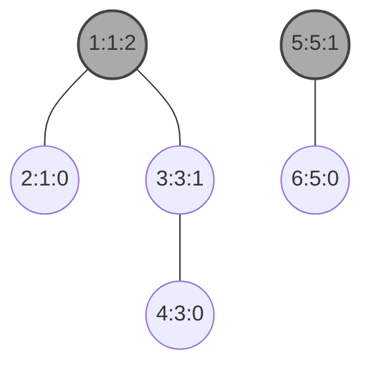
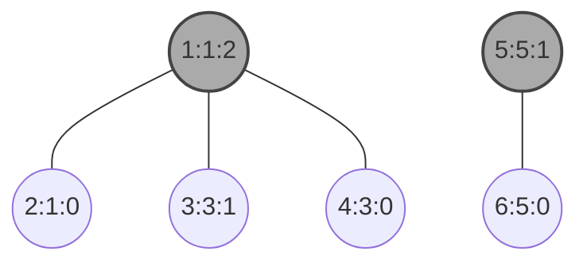
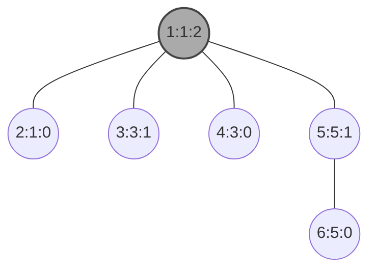

<!--more-->
* this unordered seed list will be replaced by the toc
{:toc}

## Introduction

A **Disjoint-Set Forest** (**Union-Find Forest**) is a data structure that keeps track of a partition of a set into disjoint subsets.
It supports three main operations:
1. **Add**: Add a new tree to the forest.
2. **Union**: Merge two trees into one.
3. **Find**: Determine which tree a particular element belongs to.

This data structure is particularly useful in applications such as network connectivity, clustering, and Kruskal's algorithm for finding the Minimum Spanning Tree (MST).

## Explanation

The Disjoint-Set Forest is implemented using a collection of trees, where each tree represents a disjoint set.
Let's denote the union operation as `union(x, y)` which merges the sets containing elements `x` and `y`,
and the find operation as `find(x)` which returns the representative (or root) of the set containing `x`.
And also let's denote the node as the form `value:parent:rank`, where `value` is the value of the node, `parent` is the value of its parent node, and `rank` is the rank of the node (used for union by rank).

The interactive demo below starts with nodes `1` through `6` and lets you apply **union by rank** and **path compression** yourself.
Start with six singleton sets and modify the forest directly.



Now we will seek what _path compression_ and _union by rank_ are, and how they help to optimize the `find` and `union` operations.
Path compression enables us to find the representative(or root) of a tree in nearly constant time by flattening the structure of the tree whenever we perform a `find` operation.
Union by rank helps to keep the tree flat by always attaching the smaller tree under the root of the larger tree during a `union` operation.

Consider the forest below:

```mermaid
graph TD
    A((1:1:2)):::root; B((2:1:0)); C((3:3:1));
    D((4:3:0)); E((5:5:1)):::root; F((6:5:0));
    A---B; C---D; E---F; A---C;
    classDef root fill:#aaa,stroke:#444,stroke-width:2px;
```
Root nodes of each tree are indicated with a darker color.
Let's perform `union(4,6)` on the forest above. First, we find the representatives of `4` and `6`
by `find(4)` and `find(6)`, which will return `1` and `5` respectively while also performing path compression on the way.


```mermaid
graph TD
    A((1:1:2)):::root; B((2:1:0)); C((3:3:1));
    D((4:3:0)); E((5:5:1)):::root; F((6:5:0));
    A---B & C & D; E---F;
    classDef root fill:#aaa,stroke:#444,stroke-width:2px;
```

Then we perform the `union` operation by attaching the tree with root `5` under the tree with root `1` since it has a higher rank.


```mermaid
graph TD
    A((1:1:2)):::root; B((2:1:0)); C((3:3:1));
    D((4:3:0)); E((5:5:1)); F((6:5:0));
    A---B & C & D & E; E---F;
    classDef root fill:#aaa,stroke:#444,stroke-width:2px;
```

When the rank of the roots which we are trying to union are the same, we can choose either one as the new root and increase its rank by 1.

## Complexity

The time complexity of the `find` operation is nearly constant, specifically $O(α(n))$, where α is the inverse Ackermann function.
The `union` operation also has a time complexity of $O(α(n))$ when using path compression and union by size or rank,
since it involves two `find` operations followed by a constant-time merge.

## Code

Let's see the sample code.

```cpp
const int MAX;
int par[MAX];

void init(){
    for(int i=0; i<MAX; i++) par[i]=i;
}

int Find(int x){
    if(par[x]==x) return x;
    return par[x]=Find(par[x]);
}

void Union(int u,int v){
    u=Find(u), v=Find(v);
    par[v]=u;
}
```

We can optimize the `Union` operation further by using **union by size** or **union by rank**.
This means that when we merge two trees, we always attach the smaller tree under the root of the larger tree.

- Union by size

```cpp
int size[MAX];

void init(){
    for(int i=0; i<MAX; i++) par[i]=i, size[i]=1;
}

void Union(int u,int v){
    u=Find(u), v=Find(v);
    if(u==v) return;
    if(size[u]<size[v]) swap(u,v);
    par[v]=u;
    size[u]+=size[v];
}
```

- Union by rank

```cpp
int rank[MAX];

void init(){
    for(int i=0; i<MAX; i++) par[i]=i, rank[i]=0;
}

void Union(int u,int v){
    u=Find(u), v=Find(v);
    if(u==v) return;
    if(rank[u]<rank[v]) swap(u,v);
    par[v]=u;
    if(rank[u]==rank[v]) rank[u]++;
}
```

## Applications

Disjoint-Set Forests are widely used in various applications, including:
- **Network Connectivity**: To determine if two nodes are in the same connected component.
- **Kruskal's Algorithm**: To find the Minimum Spanning Tree of a graph.
- **Image Processing**: To segment images into connected components.