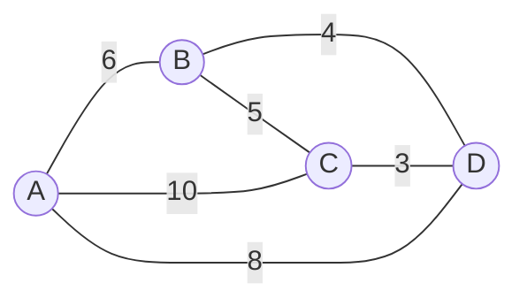
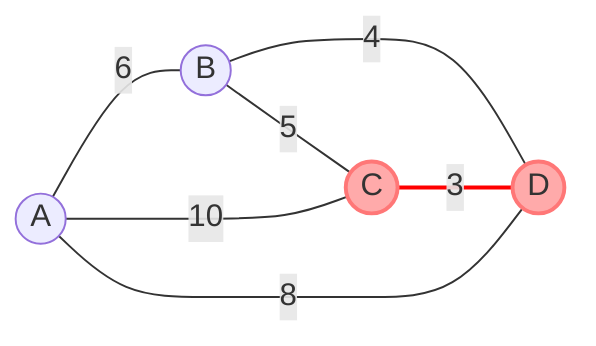
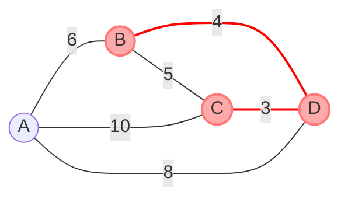
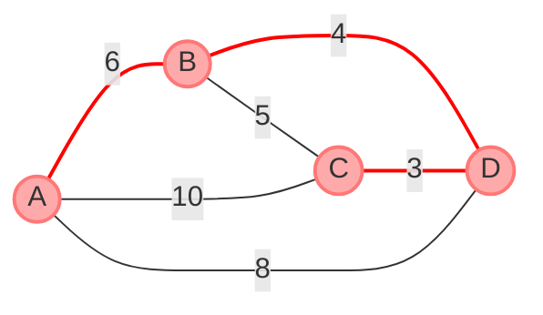
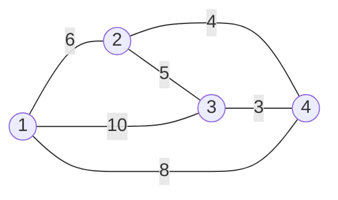
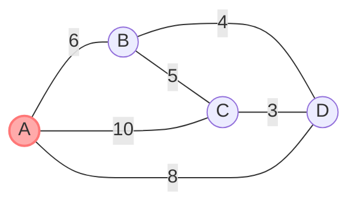
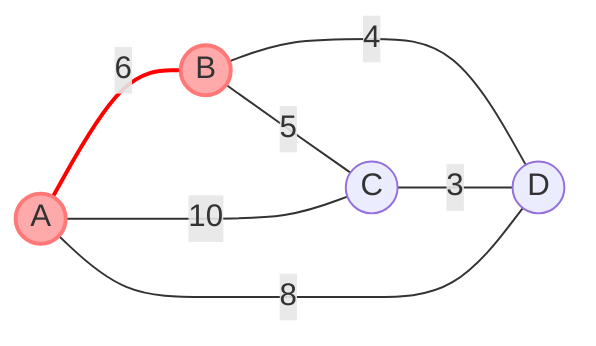
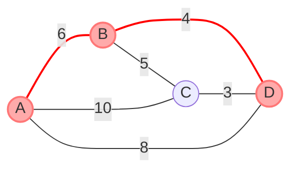

<!--more-->
* this unordered seed list will be replaced by the toc
{:toc}

## Introduction

A **Minimum Spanning Tree (MST)** of a connected, undirected graph is a spanning tree that has the minimum possible total edge weight.
A spanning tree is a subgraph that includes all the vertices of the original graph and is a tree (i.e., it is connected and has no cycles).
The MST is useful in various applications, such as network design, clustering, and optimization problems.
There are two popular algorithms to find the MST: **Kruskal's Algorithm** and **Prim's Algorithm**.

## Kruskal's Algorithm

Kruskal's Algorithm is a greedy algorithm that finds the MST by adding edges in increasing order of weight, ensuring that no cycles are formed.

1. Sort all edges in non-decreasing order of their weight.
2. Initialize an empty forest (a set of trees).
3. For each edge in the sorted list:
   - If adding the edge does not form a cycle, add it to the forest.
   - Use a disjoint-set data structure to efficiently check for cycles.

### Explanation

Start from the graph and sorted edges below.


<center>
$ E = \Set{(C,D,3), (B,D,4), (A,B,5), (A,C,6), (B,C,6), (A,D,8)} $
</center> <br>

Use a disjoint-set data structure to keep track of connected components.





The edge with weight 5 is not added because it would form a cycle.



### Complexity

The time complexity of Kruskal's Algorithm is $O(E \log E)$, where $E$ is the number of edges in the graph.
The sorting step takes $O(E \log E)$, and the union-find operations take nearly constant time due to path compression and union by rank.

### Code

```cpp
const int MAX;
struct edge{
    int u,v,w;
    bool operator<(const edge&e)const{ return w<e.w; }
};
vector<edge> G;
int par[MAX];

void init(){
    sort(G.begin(),G.end());
    for(int i=1; i<=V; i++) par[i]=i;
}

int Find(int x){
    if(par[x]==x) return x;
    return par[x]=Find(par[x]);
}

void Union(int u,int v){
    u=Find(u), v=Find(v);
    par[v]=u;
}

int Kruskal(){
    init();
    int sum=0;
    for(auto [u,v,w]:G) if(Find(u)!=Find(v)){
        Union(u,v);
        sum += w;
    }
    return sum;
}
```

## Prim's Algorithm

Prim's Algorithm is another greedy algorithm that finds the MST by growing the tree one edge at a time, starting from an arbitrary vertex.

1. Initialize a priority queue (or a min-heap) to store edges.
2. Start from an arbitrary vertex and add all its edges to the priority queue.
3. While the priority queue is not empty:
   - Extract the edge with the minimum weight.
   - If the edge connects to a vertex not already in the tree, add it to the tree and add its edges to the priority queue.

### Explanation

Start from the node A.


<center>
$ \mathrm{pq} = \Set{(A,0)} $
</center> <br>

Add all edges from A to the priority queue.


<center>
$ \mathrm{pq} = \Set{(B,6), (D,8), (C,10)} $
</center> <br>


<center>
$ \mathrm{pq} = \Set{(D,4), (C,5), (D,8), (C,10)} $
</center> <br>


<center>
$ \mathrm{pq} = \Set{(C,3), (C,5), (D,8), (C,10)} $
</center> <br>


<center>
$ \mathrm{pq} = \Set{(C,5), (D,8), (C,10)} $
</center> <br>

Then pop the priority queue until it is empty.

### Complexity

The time complexity of Prim's Algorithm is $O(E \log V)$, where $E$ is the number of edges and $V$ is the number of vertices in the graph.
Using a priority queue (min-heap) allows us to efficiently extract the minimum edge weight.

### Code

```cpp
const int MAX;
struct edge{
    int to,w;
    bool operator<(const edge &e)const{ return w>e.w; }
};
vector<edge> G[MAX];
bool chk[MAX];

int Prim(){
    int sum=0;
    priority_queue<edge,vector<edge>> pq;
    pq.push({1,0});
    while(!pq.empty()){
        auto [now,w] = pq.top();
        pq.pop();
        if(chk[now]) continue;
        chk[now] = true;
        sum += w;
        for(auto [nxt,nw]:G[now]) if(!chk[nxt]) pq.push({nxt,nw});
    }
    return sum;
}
```

## Applications

Minimum Spanning Trees have various applications, including:
- **Network Design**: Designing efficient networks with minimum cost, such as telecommunications or transportation networks.
- **Clustering**: Grouping data points in clustering algorithms, such as hierarchical clustering.
- **Optimization Problems**: Solving problems that require minimizing the total cost of connections, such as in logistics and supply chain management.