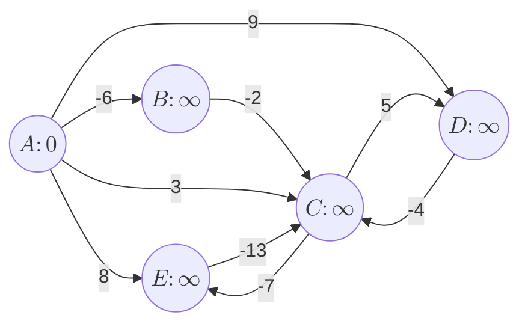
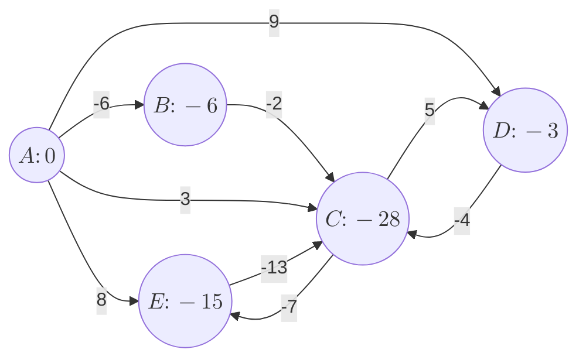
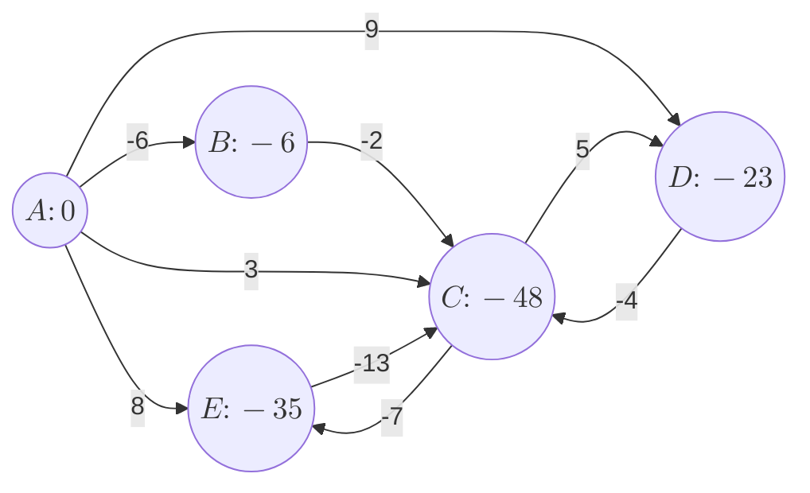
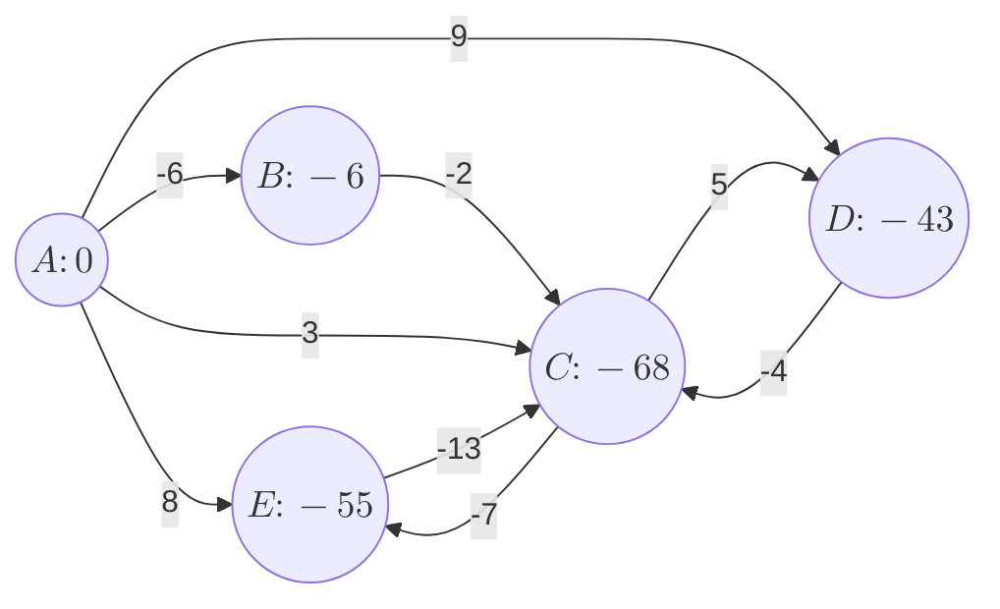

<!--more-->
* this unordered seed list will be replaced by the toc
{:toc}

## Introduction

The **Bellman--Ford algorithm** is a dynamic programming algorithm used to find the shortest paths from a single source vertex to all other vertices in a weighted graph.
It can handle graphs with negative edge weights, making it more versatile than Dijkstra's algorithm, which cannot handle negative weights.
Although it is slower than Dijkstra's algorithm, it can also detect negative weight cycles, which Dijkstra's algorithm cannot do.

## Explanation

The Bellman--Ford algorithm works by iteratively relaxing the edges of the graph.
The relaxation process updates the shortest path estimate for each vertex based on the current known shortest paths.

1. Initialize the distance to the source vertex to 0 and all other vertices to infinity.
2. Iterate through all edges and update the distance to the destination vertex if a shorter path is found.
3. Repeat the relaxation process for $V - 1$ iterations, where $V$ is the number of vertices in the graph.
4. After $V - 1$ iterations, check for negative weight cycles by iterating through all edges again. If any distance can still be updated, a negative weight cycle exists. If no updates are possible, the algorithm terminates successfully.

Consider the graph and the edges below:


<center>
$\mathrm{E} = \{(A, E, 8), (A, B, -6), (A, D, 9), (B, C, -2), (C, D, 5), (D, C, -4), (A, C, 3), (C, E, -7), (E, C, -13)\}$
</center><br>

After the first relaxation, the distances are updated as follows:



After the second relaxation, the distances are updated as follows:



After the third relaxation, the distances are updated as follows:



Likewise, for this graph, the Bellman--Ford algorithm will continue to relax the edges infinitely.
Therefore, it will detect a negative weight cycle at the end of the algorithm.

## Complexity

The time complexity of the Bellman--Ford algorithm is $O(VE)$, where $V$ is the number of vertices and $E$ is the number of edges in the graph.
The space complexity is $O(V)$, as it requires storage for the distance estimates and predecessor information for each vertex.

## Code

Let's see the sample code.

```cpp
const int MAX;
const int INF;
struct edge{
    int u,v,w;
};
vector<edge> G;
int dis[MAX];
int V,E;

void init(){
    for(int i=1; i<=V; i++) dis[i] = INF;
}

bool BellmanFord(int K){
    dis[K] = 0;
    for(int i=1; i<=V; i++) for(auto [u,v,w]:G)
        if(dis[u]!=INF and dis[u]+w<dis[v]){
            dis[v] = dis[u]+w;
            if(i==V) return false;
        }
    return true;
}
```

## Applications

The Bellman--Ford algorithm is widely used in various applications, including:
- **Network routing protocols**: It is used in protocols like RIP (Routing Information Protocol) to find the shortest paths in networks.
- **Graph analysis**: It is used to analyze graphs with negative edge weights and detect negative weight cycles.