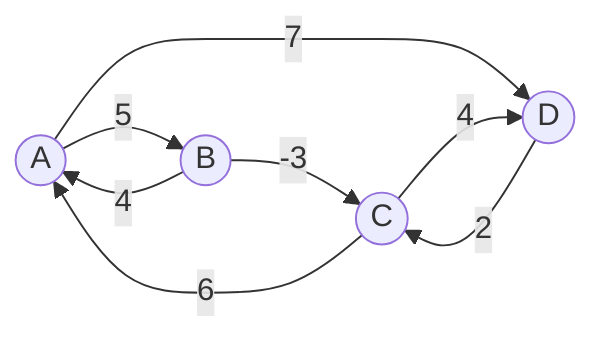

<!--more-->
* this unordered seed list will be replaced by the toc
{:toc}

## Introduction

The **Floyd--Warshall algorithm** is a dynamic programming algorithm used to find the shortest paths between all pairs of vertices in a weighted graph.
It can handle graphs with positive and negative-edge weights but does not work with graphs containing negative cycles.
The algorithm is particularly useful for dense graphs and is often used in network routing protocols.

## Explanation

The Floyd--Warshall algorithm works by iteratively improving the shortest path estimates between all pairs of vertices.

1. Create a distance matrix `dist` where `dist[i][j]` is the weight of the edge from vertex `i` to vertex `j`. If there is no edge, set it to infinity. Set `dist[i][i] = 0` for all vertices `i`.
2. For each vertex `k`, iterate through all pairs of vertices `(i, j)` and update the distance matrix:
\\[
\text{dist}[i][j] = \min(\text{dist}[i][j], \text{dist}[i][k] + \text{dist}[k][j])
\\]

Consider the graph below:


The initial distance matrix is:

| i\j   | A | B | C | D |
|-------|---|---|---|---|
| **A** | 0 | 5 | ∞ | 7 |
| **B** | 4 | 0 | -3| ∞ |
| **C** | 6 | ∞ | 0 | 4 |
| **D** | ∞ | ∞ | 2 | 0 |
{:.centered}

Afer the first iteration with `k = A`, the distance matrix becomes:

| i\j   | A | B | C | D |
|-------|---|---|---|---|
| **A** | 0 | 5 | ∞ | 7 |
| **B** | 4 | 0 | -3| 11 |
| **C** | 6 | 11| 0 | 4 |
| **D** | ∞ | ∞ | 2 | 0 |
{:.centered}

After the second iteration with `k = B`, the distance matrix becomes:

| i\j   | A | B | C | D |
|-------|---|---|---|---|
| **A** | 0 | 5 | 2 | 7 |
| **B** | 4 | 0 | -3| 11 |
| **C** | 6 | 11| 0 | 4 |
| **D** | ∞ | ∞ | 2 | 0 |
{:.centered}

After the third iteration with `k = C`, the distance matrix becomes:

| i\j   | A | B | C | D |
|-------|---|---|---|---|
| **A** | 0 | 5 | 2 | 6 |
| **B** | 3 | 0 | -3| 1 |
| **C** | 6 | 11| 0 | 4 |
| **D** | 8 | 13| 2 | 0 |
{:.centered}

After the fourth iteration with `k = D`, the final distance matrix becomes:

| i\j   | A | B | C | D |
|-------|---|---|---|---|
| **A** | 0 | 5 | 2 | 6 |
| **B** | 3 | 0 | -3| 1 |
| **C** | 6 | 11| 0 | 4 |
| **D** | 8 | 13| 2 | 0 |
{:.centered}

## Complexity

The time complexity of the Floyd--Warshall algorithm is $O(V^3)$, where $V$ is the number of vertices in the graph.
This is because the algorithm consists of three nested loops, each iterating over all vertices.
The space complexity is $O(V^2)$ due to the distance matrix.

## Code

Let's see the sample code.

```cpp
const int MAX;
const int INF;
int dist[MAX][MAX];
int N; // Number of vertices

void init(){
    for(int i=1; i<=N; i++) for(int j=1; j<=N; j++)
        dist[i][j] = (i==j)?0:INF;
}

voiid FloydWarshall(){
    for(int k=1; k<=N; k++)
        for(int i=1; i<=N; i++) for(int j=1; j<=N; j++)
            dist[i][j] = min(dist[i][j],dist[i][k]+dist[k][j]);
}
```

## Applications

The Floyd--Warshall algorithm is widely used in various applications, including:
* Optimizing network routing protocols.
* Finding the transitive closure of a directed graph.
* Inverting real-valued matrices. (Gauss--Jordan elimination)