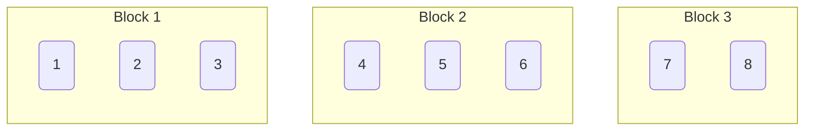

<!--more-->
* this unordered seed list will be replaced by the toc
{:toc}


## Introduction

**Sqrt decomposition** (also called **block decomposition**) is a powerful algorithmic technique used to optimize query and update operations on arrays or sequences.
The idea is to divide the array into blocks of size approximately $\sqrt{N}$ and perform operations on each block independently.
In most cases it is slower than using a segment tree, but in some cases it can be faster than a segment tree.

## Explanation

Sqrt decomposition is a data structure for monoids $(M,\ast)$.
Given an array $A=[a_1,\cdots,a_N]$ of size $N$, we can define a block decomposition of $A$ as follows:

1. Choose a block size $B = \left\lceil \sqrt{N} \right\rceil$.
2. Divide the array $A$ into $\lceil N/B \rceil$ blocks, where each block contains up to $B$ elements.
3. Precompute the aggregate value of each block using the monoid operation $\ast$.

Then, we can perform following operations on the array $A$ in $O\left(\sqrt{N}\right)$ time:

1. **Range Query**: Given a range $[l,r]$ of the array, return the aggregate value of the elements in the range.
2. **Update**: Given an index $i$ and a value $x$, update the element at index $i$ to $x$.



## Complexity

\1. **Build**: $O(N)$

It is necessary to compute the aggregate value for each block.

\2. **Range Query**: $O\left(\sqrt{N}\right)$

In the worst case, we should iterate through all blocks to compute the aggregate value for the range.

\\[
O\left( \frac{N}{B} + 2B \right) = O\left(\sqrt{N}\right)
\\]

\3. **Update**: $O\left(\sqrt{N}\right)$

We should update the aggregate value of the block containing the updated element naively,
thus the time complexity is $O(B)=$ $O\left(\sqrt{N}\right)$.
However, if the data is an abelian group, i.e., the operation is commutative and has an inverse,
we can update the aggregate value of the block just by applying the inverse operation to the old value and the operation to the new value,
which only requires $O(1)$ time.

In some cases, a factor $T(N)$ can be multiplied to the time complexity of the algorithm depending on the type of the query.


## Code

Let's see the sample code.

```cpp
data identity(); // identity element of the monoid
data op(data a, data b); // operation of the monoid

struct SqrtDecomposition {
    int N,B,num_blocks;
    vector<data> a,agg;
    explicit SqrtDecomposition(const vector<data> &init) : N(init.size()),B(ceil(sqrt(N))),num_blocks(N/B+1),a(init),agg(num_blocks,identity()) {
        build();
    }
    void build(){
        for(int i=0; i<N; i++) agg[i/B] = op(agg[i/B],a[i]);
    }
    data query(int l,int r){
        data res = identity();
        int bl = l/B, br = r/B;
        if(bl==br){
            for(int i=l; i<=r; i++) res = op(res,a[i]);
            return res;
        }
        for(int i=l; i<(bl+1)*B; i++) res = op(res,a[i]);
        for(int b=bl+1; b<br; b++) res = op(res,agg[b]);
        for(int i=br*B; i<=r; i++) res = op(res,a[i]);
        return res;
    }
    void update(int idx,data val){
        int bidx = idx/B;
        int l = bidx*B, r = min((bidx+1)*B-1,N-1);
        a[idx] = val;
        for(int i=l; i<=r; i++) agg[bidx] = op(agg[bidx],a[i]);
    }
};
```

If the data is an abelian group, we can use the following code:

```cpp
data inverse(data x); // inverse of the operation of the monoid

struct SqrtDecomposition {
    ...
    void update(int idx,data val){
        int bidx = idx/B;
        agg[bidx] = op(agg[bidx],inverse(a[idx]));
        a[idx] = val;
        agg[bidx] = op(agg[bidx],a[idx]);
    }
};
```

### Example

Consider calculating the remainder of the range product with modulo $p$.

```cpp
int identity(){ return 1; }
int op(int a,int b){ return a*b%p; }
int inverse(int x){ return pow(x,p-2,p); }
```

## Applications

 - Range sum/min/max
 - Counting elements less/greater than a value (more efficient than segment tree)
 - Mo's algorithm
