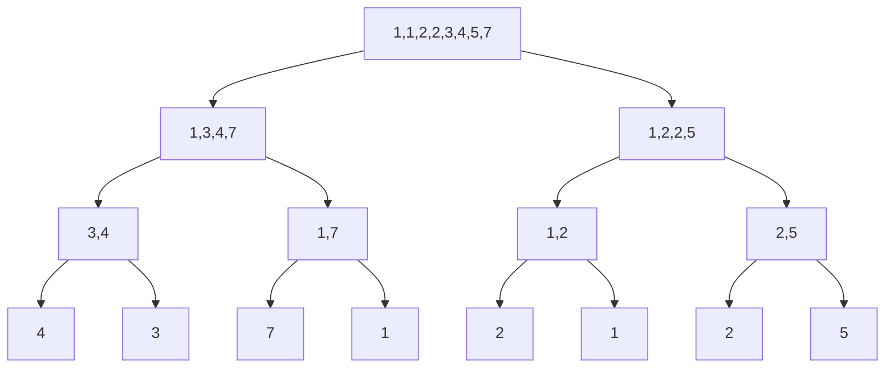

<!--more-->
* this unordered seed list will be replaced by the toc
{:toc}

## Introduction

A **merge sort tree** is a specialized data structure that combines the properties of a segment tree with the ability to efficiently perform range queries on sorted data.
It usually does not support updates efficiently.

## Merge Sort Tree

### Explanation

A merge sort tree is built on top of a segment tree, where each node contains a sorted list of elements corresponding to the segment it represents.
The tree is constructed by recursively dividing the array into segments and merging the sorted lists of child nodes.
Each node in the merge sort tree is a _multiset_ (or sorted array), and the merge sort tree can only efficiently answer range queries that satisfy the following condition:

- For the query function $F$, multisets $S_1,S_2$, and a query result combiner function $G(\cdot,\cdot)$,

\\[
F(S_1 \cup S_2) = G(F(S_1), F(S_2))
\\]

This means that the result of the query on the union of two multisets can be computed by combining the results of the queries on each individual multiset,
and $F$ only depends on the order statistics of the array.

For example, for an array $[4,3,7,1,2,1,2,5]$, the merge sort tree would be built as follows:



### Complexity

Suppose the size of the input array is $N$, it takes $O(T(N))$ time to compute the query for a segment.

\1. **Build**: $O(N \log N)$

It takes $O(A+B)$ time to merge two sorted lists of sizes $A$ and $B$.
Since the size of array is $N$ and at each level of the segment tree we merge $N$ elements,
it takes $O(N)$ time per level.
The height of the segment tree is $O(\log N)$, so the total time complexity for building the merge sort tree is $O(N \log N)$.

\2. **Query**: $O(T(N) \log N)$

From [here](/computer-science/segment-tree.html), we know that for each range query, we visit $O(\log N)$ nodes in the segment tree.
At each visited node, we perform a query on the sorted list stored in that node, which takes $O(T(N))$ time.
Therefore, the total time complexity for a range query is $O(T(N) \log N)$.

\3. **Space Complexity**: $O(N \log N)$

The space complexity of a merge sort tree is $O(N \log N)$ because each level of the segment tree stores $N$ elements in sorted lists, and there are $O(\log N)$ levels in the tree.

## Code

Let’s see the sample code.
```cpp
#define all(v) v.begin(),v.end()

const int N;
const int TREE_SIZE = 1 << ((int)ceil(log2(N)) + 1);
using vec = vector<data>; // orderable data type

data A[N];
struct Node{
    vec v; // sorted array
    // other members if needed
} tree[TREE_SIZE];

Node merge_Node(Node a,Node b){
    Node res;
    res.v.resize(a.v.size()+b.v.size());
    merge(all(a.v), all(b.v), res.v.begin());
    // other member merges if needed
    return res;
}

Node conv(data a){
    Node res;
    res.v = {a};
    // other member initializations if needed
    return res;
}

q F(Node nd); // query function on a node
q G(q a,q b); // query result combiner function
q identity(); // return identity query result

Node init(int l,int r,int nd){
    if(l==r) return tree[nd] = conv(A[l]);
    int m = (l+r)/2;
    return tree[nd] = merge_Node(init(l,m,nd*2),init(m+1,r,nd*2+1));
}

q Query(int l,int r,int nd,int s,int e){
    if(e<l or r<s) return identity();
    if(s<=l and r<=e) return F(tree[nd]);
    int m = (l+r)/2;
    return G(Query(l,m,nd*2,s,e),Query(m+1,r,nd*2+1,s,e));
}
```

### Example

Suppose we want to count the number of elements less than or equal to a given value $K$ in a range $[L, R]$ of the array.

```cpp
int A[N];
struct Node{
    vec v;
} tree[TREE_SIZE];

q F(Node nd, int K){
    return upper_bound(all(nd.v), K) - nd.v.begin();
}
q G(q a,q b){
    return a + b;
}
q identity(){
    return 0;
}
```

In this example, time complexity of the query function $F$ is $T(N) = O(\log N)$ due to the binary search performed by `upper_bound`.
Thus, the overall time complexity for a range query becomes $O(\log^2 N)$.