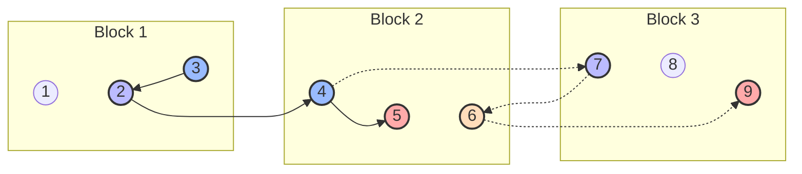

<!--more-->
* this unordered seed list will be replaced by the toc
{:toc}

## Introduction

**Mo's Algorithm** is an offline algorithm optimization technique to answer multiple range queries on a static array.
It employs an idea from the **[sqrt-decomposition](/computer-science/sqrt-decomposition.html)** technique, 
enabling us to answer each query averagely in $O\left( \sqrt{N} \right)$ time.

## Explanation

Mo's Algorithm can handle multiple range queries on a static array sorting the queries.
The queries should be able to be computed by adding or removing elements from the current range so that 
we can move the start and end pointers of the range to answer each query. We here use an idea from
the sqrt-decomposition technique; dividing the array into blocks of size approximately $\sqrt{N}$, and sorting the queries
first by the block of their start position, and then by their end position.

Mathematically speaking, we can answer a query $F([l,r])=F_s(f([l,r]))$ for an array $A=[a_1,\cdots,a_N]$ of size $N$ if $f$ satisfies the following properties:
 - $f([l,r+1]) = U_{\rm r}(f([l,r]), a_{r+1})$
 - $f([l,r-1]) = D_{\rm r}(f([l,r]), a_r)$
 - $f([l-1,r]) = U_{\rm l}(f([l,r]), a_{l-1})$
 - $f([l+1,r]) = D_{\rm l}(f([l,r]), a_l)$

where $U_{\rm r}$ and $D_{\rm r}$ are right adding and removing functions, $U_{\rm l}$ and $D_{\rm l}$ are left adding and removing functions respectively.
$f$ is a function that maps an range $[l,r]$ to a latent result, and $F_s$ is a function that maps the latent result to the final answer.
The functions should satisfy the following properties:
- $D_{\rm r}(U_{\rm r}(f([l,r]), a_{r+1}), a_{r+1}) = U_{\rm r}(D_{\rm r}(f([l,r]), a_r), a_r) = f([l,r])$
- $D_{\rm l}(U_{\rm l}(f([l,r]), a_{l-1}), a_{l-1}) = U_{\rm l}(D_{\rm l}(f([l,r]), a_l), a_l) = f([l,r])$

In other words, for all $x$,
- $U_{\rm r}(\cdot,x) = (D_{\rm r}(\cdot,x))^{-1}$
- $U_{\rm l}(\cdot,x) = (D_{\rm l}(\cdot,x))^{-1}$

This means, after computing $f([l_1,r_1])$, we can compute $f([l_2,r_2])$ by applying
$U_{\rm l}$ or $D_{\rm l}$ $\abs{l_2-l_1}$ times and $U_{\rm r}$ or $D_{\rm r}$ $\abs{r_2-r_1}$ times.
For the whole set of $Q$ queries, we should minimize the sum of the shifts:

\\[
\sum_{q=1}^{Q-1} \abs{l_q-l_{q+1}} + \abs{r_q-r_{q+1}}
\\]

and this can be done by a "proper" sorting of the queries explained above.

\\[
(l_1,r_1) < (l_2,r_2) \;\Leftrightarrow\; \begin{cases}
\dps \left\lfloor \frac{l_1}{B} \right\rfloor < \left\lfloor \frac{l_2}{B} \right\rfloor &\nl
r_1 < r_2 & \text{if } \dps \left\lfloor \frac{l_1}{B} \right\rfloor = \left\lfloor \frac{l_2}{B} \right\rfloor
\end{cases}
\\]

where $B = \left\lceil \sqrt{N} \right\rceil$ is the block size.
Let's look at an example. For the following range queries,

\\[
\Set{(4,6),(5,9),(2,7),(3,4)}
\\]

we process them in the following order:



The solid lines are the shift of left pointers, and the dotted lines are the shift of right pointers.
Though it is not the global optimal minimum of the shifts, this method gives enough time complexity to handle lots of queries.

## Complexity

Denote $S(N)$ as the time complexity to shift the pointers by one position ($U_{\rm l}$, $D_{\rm l}$, $U_{\rm r}$, $D_{\rm r}$),
$T(N)$ as the time complexity to compute $F_s$ from the latent result.

\1. Sorting the queries: $O(Q \log Q)$

\2. Shifting the pointers: $O\left((N + Q) \sqrt{N} S(N)\right)$

Let's think of two cases: when successive queries have their start positions in the same block, and when they are in different blocks.
When they are in the same block, the left pointer shifts at most $B$ times, and the right pointer shifts at most $N$ times in total for all such queries since they are monotonically increasing.
Thus, the total shift number is $O\left( BQ + N \cdot \frac{N}{B} \right) = O\left( (N+Q) \sqrt{N} \right)$.
When they are in different blocks, the left and right pointers shift at most $N$ times each.
This case only occurs $O\left( \frac{N}{B} \right)$ times, so the total shift number is $O\left( N \cdot \frac{N}{B} \right) = O\left( N \sqrt{N} \right)$.
Therefore, the overall time complexity is $O\left( (N+Q) \sqrt{N} S(N) \right)$.

\3. Computing answers: $O(Q T(N))$

Thus, the overall time complexity is:

\\[
O\left( Q\log Q + (N+Q) \sqrt{N} S(N) + Q T(N) \right)
\\]

We usually use Mo's Algorithm for problems with $S(N) \approx O(1), T(N) \le O\left( \sqrt{N} \right)$
so that the overall time complexity becomes:

\\[
O\left( (N+Q) \sqrt{N} \right)
\\]

## Code

Let's see the sample code.

```cpp
const int N,Q;
const int B = ceil(sqrt(N)); // block size

struct Query {
    int l,r,idx;
    bool operator<(const Query& q) const {
        if(l/B != q.l/B) return l/B < q.l/B;
        return r < q.r;
    }
} query[Q];
q ans[Q];
data A[N];
latent f;

void Add(int x,bool dir); // add A[x] to the current range if(dir) right, else left, and update f
void Remove(int x,bool dir); // remove A[x] from the current range if(dir) right, else left, and update f
q GetAnswer(); // compute the final answer from f

void Mo(){
    sort(query,query+Q);
    int l=query[0].l, r=query[0].r, idx=query[0].idx;
    for(int i=l; i<=r; i++) Addr(i);
    ans[idx] = GetAnswer();
    for(int i=1; i<Q; i++){
        int ql=query[i].l, qr=query[i].r;
        idx = query[i].idx;
        while(ql<l) Add(--l,0);
        while(r<qr) Add(++r,1);
        while(l<ql) Remove(l++,0);
        while(qr<r) Remove(r--,1);
        ans[idx] = GetAnswer();
    }
}
```

### Example

Consider counting the number of distinct elements in a range.

```cpp
const int RANGE;
int A[N], cnt[RANGE], ans[Q];
int distinct;

void Add(int x){ if(!cnt[A[x]]) distinct++; cnt[A[x]]++; }
void Remove(int x){ cnt[A[x]]--; if(!cnt[A[x]]) distinct--; }
int GetAnswer(){ return distinct; }
```