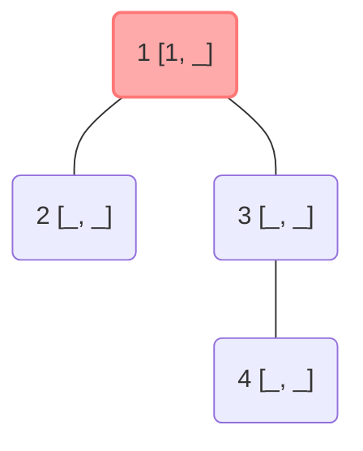
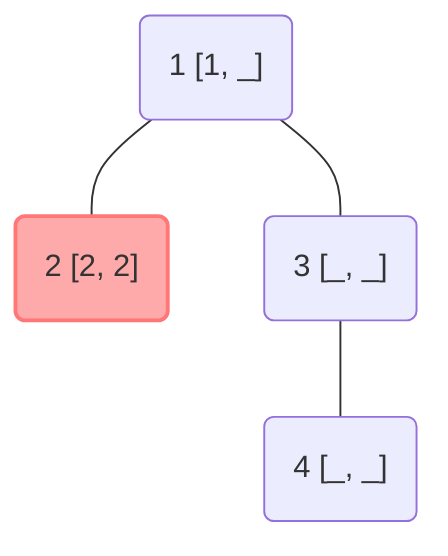
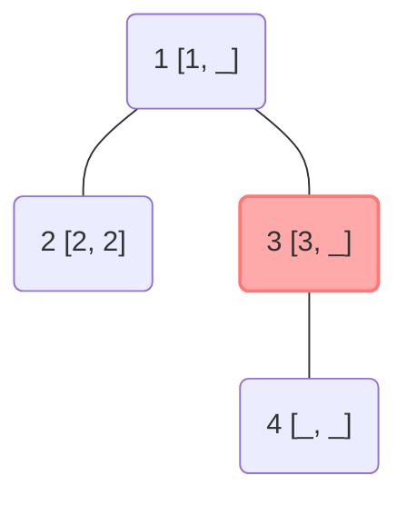
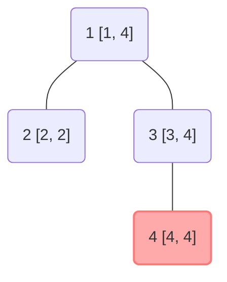

<!--more-->
* this unordered seed list will be replaced by the toc
{:toc}

## Introduction

**Euler Tour Technique(ETT)** is a powerful method which enables us to perform various operations on a subtree of a given tree.
By a simple depth-first search(dfs), we can represent each subtree as an interval of an index array.

## Explanation

Suppose that we have a tree with $N$ nodes, rooted at node $1$.
The following is a step-by-step explanation of ETT.

1. Start from node $1$, perform dfs recursively.
2. When we visit a node, we record the time of visiting an array `in[]`. Time is counted from the root node, increasing by one for each node.
3. After visiting all children of a node and returning to it, we record the time of getting out of the node `out[]`.

Let's see a simple example. The node is labeled as `node_number [in_time, out_time]`.



Visiting the node $2$,



Visiting the node $3$,



Finally visiting the node $4$ and returning to $3$ and $1$,



Since the algorithm is just a slight variation of dfs, the time complexity is $O(N)$.

## Code

Let's see the sample code.

```cpp
const int MAX;
vector<int> G[MAX];
int in[MAX], out[MAX];
int time;

void dfs(int now,int prev){
    in[now] = ++time;
    for(int next:G[now]) if(next!=prev) dfs(next,now);
    out[now] = time;
}
```

## Applications

* ETT is usually used with a segment tree with lazy propagation to efficiently perform range updates and queries on subtrees.