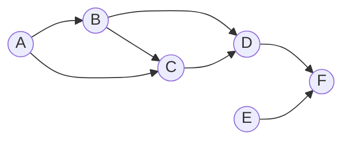
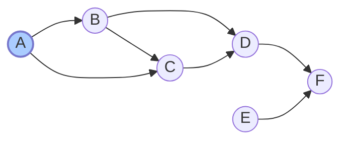
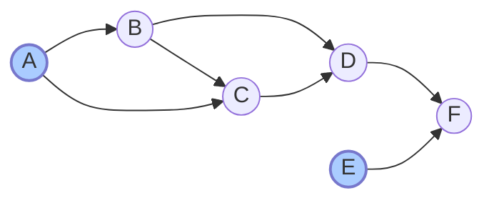
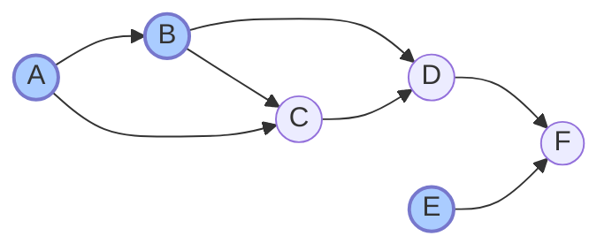
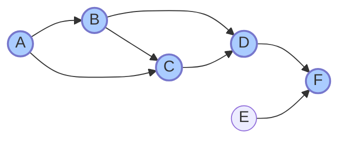

<!--more-->
* this unordered seed list will be replaced by the toc
{:toc}

## Introduction

**Topological sorting** is a linear ordering of the vertices in a _directed acyclic graph (DAG)_ such that for every directed edge
$u \to v$, vertex $u$ comes before vertex $v$ in the ordering.
A topological ordering is not unique; there can be multiple valid orderings for a given DAG.
In contrast, if the graph contains a cycle, a topological sort is not possible.
Topological sorting is widely used in various applications, including task scheduling, dependency resolution, and course prerequisite planning.
There are two primary algorithms for performing topological sorting: **Kahn's Algorithm** and **Depth-First Search (DFS)** based approach.

## Kahn's Algorithm

Kahn's Algorithm is an iterative method that uses in-degrees of vertices to determine the topological order.

1. Initialization:
   - Compute the in-degree (number of incoming edges) for each vertex in the graph.
   - Create a queue and enqueue all vertices with an in-degree of 0.
2. Process the Queue:
   - While the queue is not empty:
     - Dequeue a vertex `u` from the queue and add it to the topological order.
     - For each neighbor `v` of `u`, decrease the in-degree of `v` by 1.
     - If the in-degree of `v` becomes 0, enqueue `v`.
3. Check for Cycles:
   - If the topological order contains all vertices, the graph is a DAG, and the topological sort is complete.
   - If not, the graph contains a cycle, and topological sorting is not possible.

### Explanation

Start from the DAG and the in-degrees below:


<center>
$ \text{In} = (0,1,2,2,0,2) $
</center> <br>

Then we enqueue vertices with in-degree 0, which are A and E.
<center>
$ Q = [A,E] $
</center> <br>

Dequeue A and add it to the topological order. Then we decrease the in-degrees of its neighbors B and C.


<center>
$ \text{In} = (0,0,1,2,0,2) \nl
Q = [E,B] \nl
\text{Top} = [A] $
</center> <br>

Next, we dequeue E and add it to the topological order. Then we decrease the in-degree of its neighbor F.


<center>
$ \text{In} = (0,0,1,2,0,1) \nl
Q = [B] \nl
\text{Top} = [A,E] $
</center> <br>

Now, we dequeue B and add it to the topological order. Then we decrease the in-degrees of its neighbors C and D.


<center>
$ \text{In} = (0,0,0,1,0,1) \nl
Q = [C] \nl
\text{Top} = [A,E,B] $
</center> <br>

Continue this process until the queue is empty. The final topological order will be:

<center>
$ \text{Top} = [A,E,B,C,D,F] $
</center>

### Complexity

It takes $O(V + E)$ time, where $V$ is the number of vertices and $E$ is the number of edges in the graph,
since each vertex and edge is processed once.

### Code

Let’s see the sample code.

```cpp
const int MAX;
vector<int> G[MAX];
int in_degree[MAX];
vector<int> topological_order;

bool Kahn(){
    queue<int> Q;
    for(int u=1; u<=V; u++) for(int v:G[u]) in_degree[v]++;
    for(int u=1; u<=V; u++) if(in_degree[u]==0) Q.push(u);
    while(!Q.empty()){
        int now = Q.front(); Q.pop();
        topological_order.push_back(now);
        for(int nxt:G[now]){
            in_degree[nxt]--;
            if(in_degree[nxt]==0) Q.push(nxt);
        }
    }
    return (topological_order.size()==V);
}
```

## DFS Based Approach

1. Perform a DFS for each unvisited vertex in the graph.
2. During the DFS, when a vertex finishes (i.e., all its neighbors have been visited), push it onto a stack.
3. After the DFS is complete for all vertices, pop vertices from the stack to get the topological order.

### Explanation

Start from the DAG below:


Perform DFS starting from vertex A.
In the process, we visit B, then C, then D, and finally F.
Backtrack and pushing vertices onto the stack as they finish, we get the following order in the stack:

<center>
$ \text{Stack} = [F,D,C,B,A] $
</center> <br>



Finally, we perform DFS starting from vertex E, and push it onto the stack, and we get the full topological order:

<center>
$ \text{Stack} = [F,D,C,B,A,E] \nl
\text{Top} = [E,A,B,C,D,F] $
</center>

### Complexity

Similar to Kahn's Algorithm, it takes $O(V + E)$ time,
since it's basically an application of DFS algorithm.

### Code

Let’s see the sample code.

```cpp
const int MAX;
vector<int> G[MAX];
bool visited[MAX];
vector<int> topological_order;

void dfs(int now){
    visited[now] = true;
    for(int nxt:G[now]) if(!visited[nxt]) dfs(nxt);
    topological_order.push_back(now);
}

void TopologicalSort(){
    for(int u=1; u<=V; u++) if(!visited[u]) dfs(u);
    reverse(topological_order.begin(), topological_order.end());
}
```

You can either use stack as described in the explanation.

## Applications

- Task Scheduling: Determining the order of tasks based on dependencies.
- Course Prerequisite Planning: Ordering courses based on prerequisite requirements.
- Data Serialization: Ordering data elements based on dependencies for serialization.