<!--more-->
* this unordered seed list will be replaced by the toc
{:toc}

## Introduction

In the theory of directed graphs, a graph is said to be **strongly connected** if there is a path from each vertex in the graph to every other vertex.
The **strongly connected components(SCC)** of a directed graph are the maximal partitions of the graph such that each partitioned subgraph is strongly connected.
If we consider the strongly connected components of a directed graph as single vertices, we can form a directed acyclic graph (DAG) of these components,
which implies that we could find a topological ordering of the DAG.
There are two well-known algorithms for finding strongly connected components: **Kosaraju's Algorithm** and **Tarjan's Algorithm**.

## Kosaraju's Algorithm

Kosaraju's Algorithm is a simple and efficient algorithm for finding SCCs.

1. Traverse the graph by DFS and push the vertices onto a stack in the order of their finishing times.
2. Pop a vertex from the stack and perform a DFS again on the transposed graph starting from that vertex. The vertices reached in this DFS form a single strongly connected component.
3. Repeat step 2 until the stack is empty.

### Explanation

Start from the graph below. After the first DFS starting from vertex A, we have the following stack:

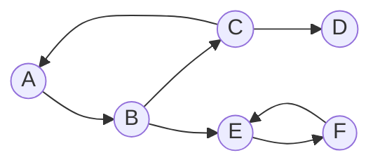
<center>
$ \text{Stack} = (D,C,F,E,B,A) $
</center> <br>

After popping vertex $A$ from the stack, we perform a DFS on the transposed graph starting from vertex $A$.
The vertices reached in this DFS form a single strongly connected component.

<div style="display:flex; gap:40px;">
<div style="flex:1;" markdown="1">
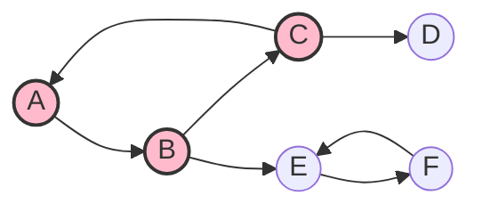
</div>
<div style="flex:1;" markdown="1">
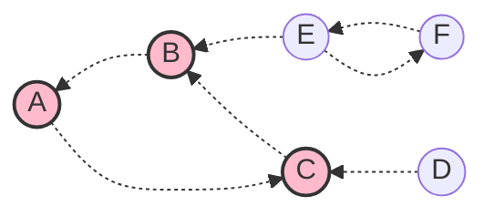
</div>
</div>
<div style="display:flex;">
<div style="flex:1;">
<center> $ G $ </center>
</div>
<div style="flex:1;">
<center> $ G^\top $ </center>
</div>
</div> <br>

<center>
$ \text{Stack} = (D,C,F,E) $
</center> <br>

Next, pop vertex $E$ from the stack and repeat the process.

<div style="display:flex; gap:40px;">
<div style="flex:1;" markdown="1">
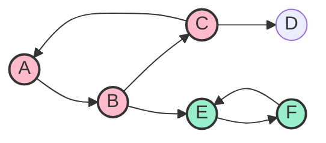
</div>
<div style="flex:1;" markdown="1">
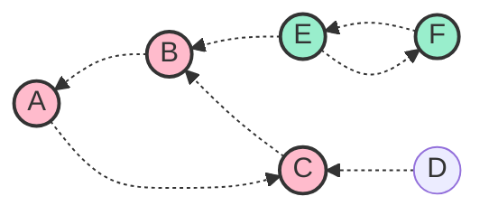
</div>
</div>
<div style="display:flex;">
<div style="flex:1;">
<center> $ G $ </center>
</div>
<div style="flex:1;">
<center> $ G^\top $ </center>
</div>
</div> <br>

Repeating this process until the stack is empty, we get the strongly connected components of the graph.

<div style="display:flex; gap:40px;">
<div style="flex:1;" markdown="1">
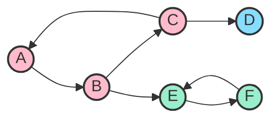
</div>
<div style="flex:1;" markdown="1">
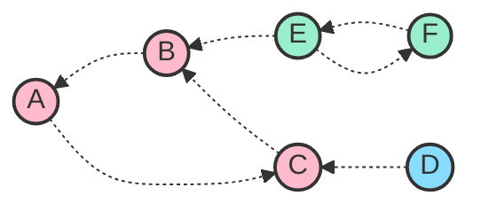
</div>
</div>
<div style="display:flex;">
<div style="flex:1;">
<center> $ G $ </center>
</div>
<div style="flex:1;">
<center> $ G^\top $ </center>
</div>
</div> <br>

<center>
$ \text{SCC} = \Set{ \Set{A,B,C}, \Set{D}, \Set{E,F} } $
</center> <br>

The DAG of the strongly connected components is shown below.

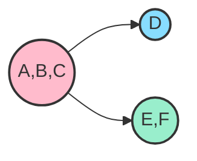

### Complexity

The time complexity of Kosaraju's Algorithm is $ O(V + E)$ since all we do is a DFS traversal of the graph.

### Code

Let’s see the sample code.

```cpp
const int MAX;
using vec = vector<int>;
vec G[MAX], GT[MAX]; // G: graph, GT: transposed graph
bool chk[MAX];
stack<int> Stk;
vector<vec> SCCs;

void dfs(int now){
    chk[now] = true;
    for(int next: G[now]) if(!chk[next]) dfs(next);
    Stk.push(now);
}

void dfs_t(int now,vec &v){
    chk[now] = true;
    v.push_back(now);
    for(int next: GT[now]) if(!chk[next]) dfs_t(next,v);
}

void Kosaraju(){
    for(int u=1; u<=V; u++) if(!chk[u]) dfs(u);
    fill(chk, chk+MAX, false);
    while(!Stk.empty()){
        int u = Stk.top(); Stk.pop();
        if(chk[u]) continue;
        vec v;
        dfs_t(u,v);
        SCCs.push_back(v);
    }
}
```

## Tarjan's Algorithm

Tarjan's Algorithm is another efficient algorithm for finding SCCs.
It only requires a single DFS traversal of the graph unlike Kosaraju's Algorithm.

1. Traverse the graph by DFS and push the vertices onto a stack as they are visited.
2. Mark its visit time and low-link value as the visit time.
3. For each neighbor of a currently visited vertex, do the following.
 - If it's not visited yet, traverse it by DFS and update the low-link value of the current vertex as the minimum of itself and the low-link value of the neighbor.
 - If it's visited but on the stack (i.e., its SCC is not yet determined), update the low-link value of the current vertex as the minimum of itself and the visit time of the neighbor.
4. After visiting all neighbors, if the low-link value of the current vertex is equal to its visit time, it's a root of a strongly connected component, so process the following.
 - Pop the stack until the current vertex is found and add it to the SCC.
 - Popped vertices form a strongly connected component, so mark them as their SCCs are determined.

### Explanation

Remind the graph above. Start from vertex $A$, and mark its visit time and low-link value.

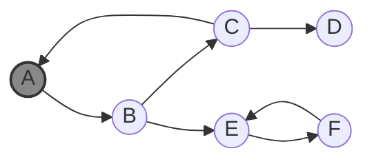
<center>
$ \text{Stack} = (A) \nl \text{Time} = (1,0,0,0,0,0) \nl \text{Low} = (1,0,0,0,0,0) $
</center> <br>

Next, visit vertex $B$.

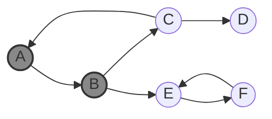
<center>
$ \text{Stack} = (A,B) \nl \text{Time} = (1,2,0,0,0,0) \nl \text{Low} = (1,2,0,0,0,0) $
</center> <br>

Next, visit vertices $E$ and $F$.

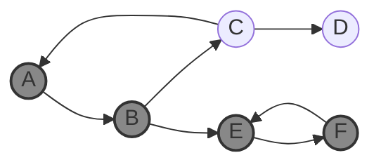
<center>
$ \text{Stack} = (A,B,E,F) \nl \text{Time} = (1,2,0,0,3,4) \nl \text{Low} = (1,2,0,0,3,4) $
</center> <br>

From vertex $F$, we check its neighbor $E$. Since $E$ is already visited and on the stack, we update its low-link value as $3$.

<center>
$\text{Low} = (1,2,0,0,3,3) $
</center> <br>

DFS of vertex $F$ is finished, so we return to vertex $E$. Since its low-link value is $3$, it's a root of a single SCC, so we pop the stack until we find vertex $E$.
Therefore, $\Set{ E,F }$ forms a single SCC. Next, we return to vertex $B$, and visit vertices $C$ and $D$.

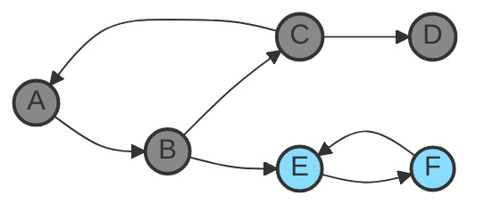
<center>
$ \text{Stack} = (A,B,C,D) \nl \text{Time} = (1,2,5,6,3,4) \nl \text{Low} = (1,2,5,6,3,3) $
</center> <br>

$D$ forms SCC itself. Return to vertex $C$ and visit vertex $A$.
Since $A$ is already visited and on the stack, we update its low-link value of $C$ as $1$.

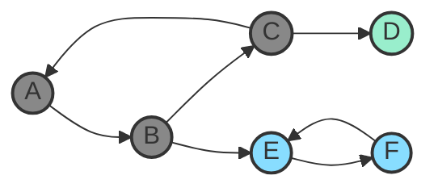
<center>
$ \text{Stack} = (A,B,C) \nl \text{Time} = (1,2,5,6,3,4) \nl \text{Low} = (1,2,1,6,3,3) $
</center> <br>

Return to vertex $B$, and update its low-link value of $B$ as $1$.
Return to vertex $A$, which is the root of the SCC, and pop the stack until we find vertex $A$.
Therefore, $\Set{ A,B,C }$ forms a single SCC.


<center>
$ \text{Stack} = () \nl \text{Time} = (1,2,5,6,3,4) \nl \text{Low} = (1,1,1,6,3,3) $
</center> <br>

Finally, we get the strongly connected components of the graph, exactly the same as the result of Kosaraju's Algorithm.

<center>
$ \text{SCC} = \Set{ \Set{A,B,C}, \Set{D}, \Set{E,F} } $
</center> <br>

### Complexity

Tarjan's Algorithm requires $ O(V + E) $ time, since it only requires a single DFS traversal of the graph.
Each vertex is pushed and popped from the stack only once, so it doesn't affect the overall complexity.

### Code

Let’s see the sample code.

```cpp
const int MAX;
using vec = vector<int>;
vec G[MAX];
int low[MAX], time[MAX];
bool chk[MAX];
stack<int> Stk;
vector<vec> SCCs;
int cnt;

void dfs(int now){
    time[now] = low[now] = ++cnt;
    Stk.push(now);
    for(int next: G[now]){
        if(!time[next]){
            dfs(next);
            low[now] = min(low[now], low[next]);
        }
        else if(!chk[next]) low[now] = min(low[now], time[next]);
    }
    if(low[now] == time[now]){
        vec v;
        while(true){
            int t = Stk.top(); Stk.pop();
            chk[t] = true;
            v.push_back(t);
            if(t == now) break;
        }
        SCCs.push_back(v);
    }
}

void Tarjan(){
    for(int u=1; u<=V; u++) if(!time[u]) dfs(u);
}
```

There is also a way to implement Tarjan's Algorithm, without using the `low` array.

```cpp
int dfs(int now){
    int low = time[now] = ++cnt;
    Stk.push(now);
    for(int next: G[now]){
        if(!time[next]) low = min(low, dfs(next));
        else if(!chk[next]) low = min(low, time[next]);
    }
    if(low == time[now]){
        vec v;
        while(true){
            int t = Stk.top(); Stk.pop();
            chk[t] = true;
            v.push_back(t);
            if(t == now) break;
        }
        SCCs.push_back(v);
    }
    return low;
}
```

## Applications

 - Solving 2-SAT problem
 - Finding the DAG of SCCs and its topological ordering